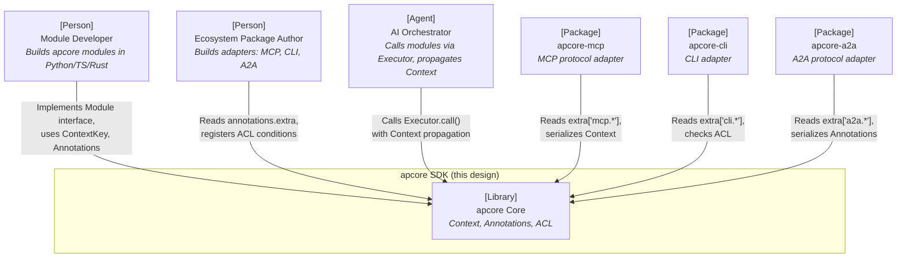
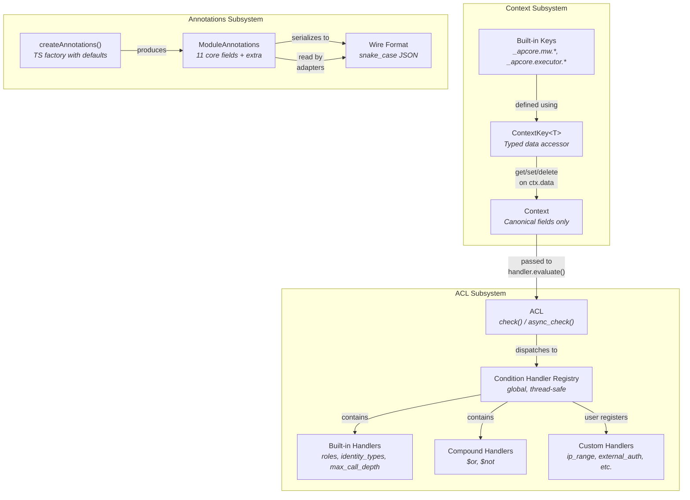
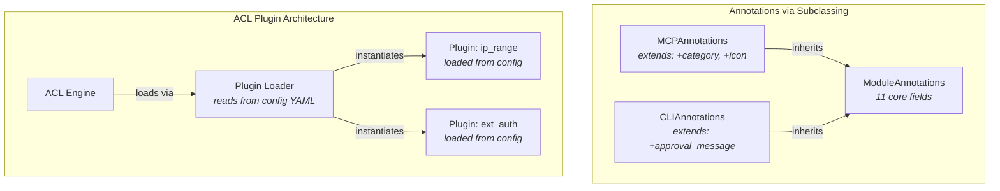
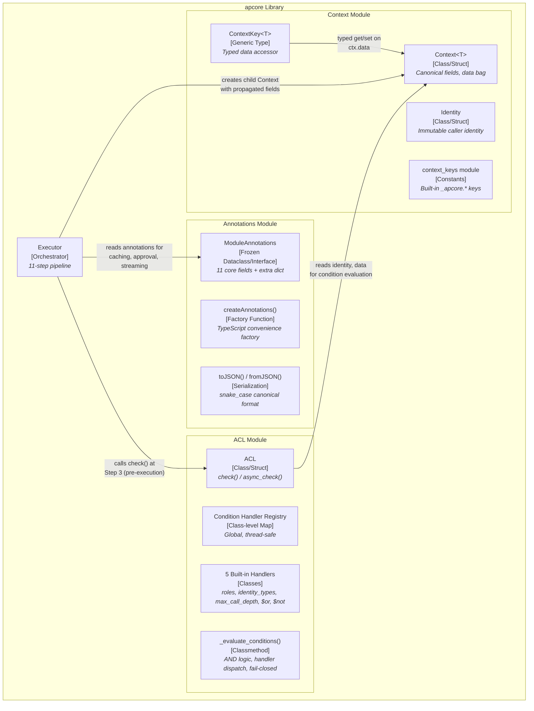
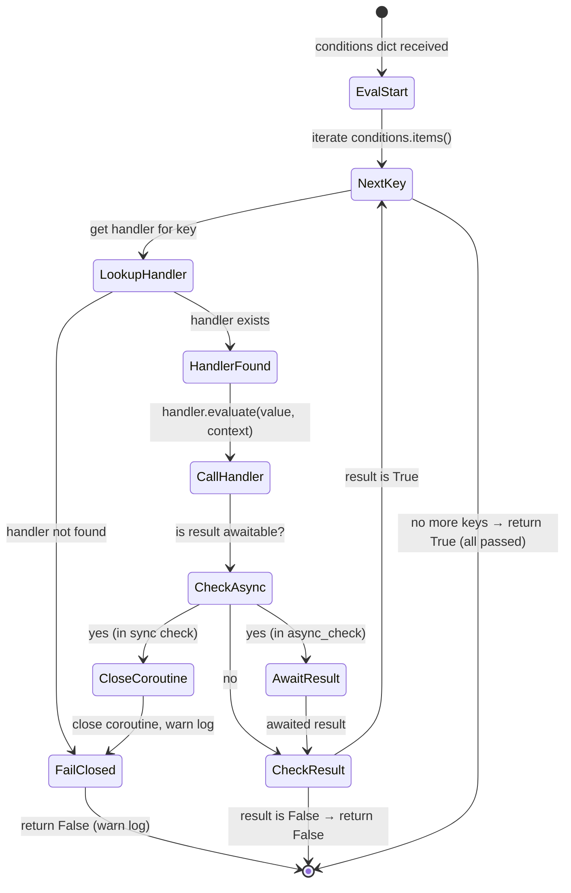
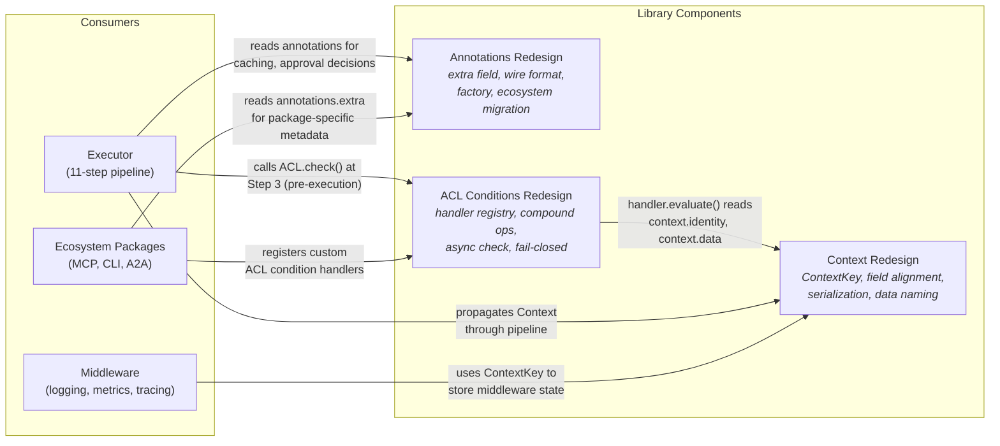
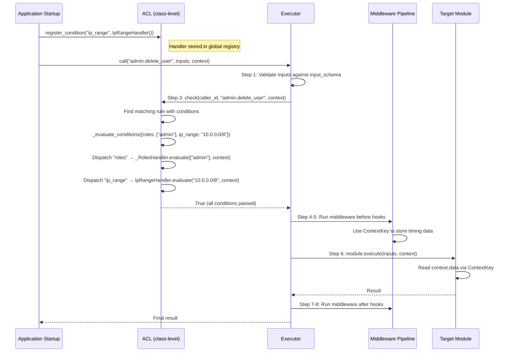
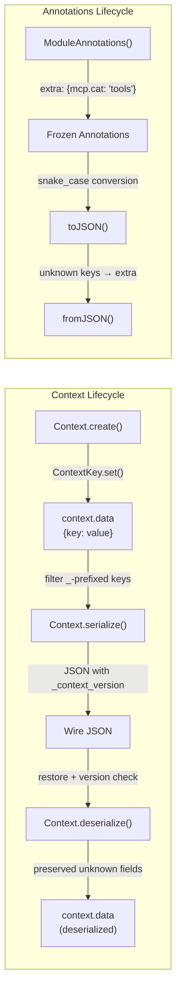

# Technical Design Document: Context, Annotations & ACL Interface Redesign

---

## 1. Document Information

| Field | Value |
|-------|-------|
| **Document Title** | Technical Design: Context, Annotations & ACL Interface Redesign |
| **Version** | 0.1 |
| **Author** | apcore team |
| **Reviewers** | SDK maintainers (Python, TypeScript, Rust) |
| **Date** | 2026-04-01 |
| **Status** | Draft |
| **Related PRD** | N/A |
| **Related SRS** | N/A |
| **Design Input** | `docs/spec/design-context-annotations-acl.md` |

---

## 2. Revision History

| Version | Date | Author | Description |
|---------|------|--------|-------------|
| 0.1 | 2026-04-01 | apcore team | Initial draft |

---

## 3. Overview

### 3.1 Background

apcore is an AI-Perceivable module standard providing cross-language SDK implementations (Python 3.11+, TypeScript/Node 18+, Rust 1.75+). The framework's three core subsystems -- Context (execution context propagation), ModuleAnnotations (behavioral metadata), and ACL (access control) -- have diverged across SDK implementations over the past development cycles.

Specific divergences include: Rust SDK has 3 non-spec fields (`created_at`, `parent_trace_id`, `trace_context`); TypeScript SDK is missing `globalDeadline`; `context.data` key naming violates the `_apcore.` prefix convention; Rust `Identity` fields are mutable despite the spec requiring immutability; `ModuleAnnotations` has no extension mechanism; and ACL conditions are hardcoded with no custom handler support.

This design addresses all three subsystems in a single coordinated effort because their interfaces are interdependent: ACL condition handlers read from Context, Annotations inform execution decisions that require Context propagation, and ecosystem packages (apcore-mcp, apcore-cli, apcore-a2a) consume all three.

### 3.2 Goals

- **G1: Cross-language field alignment** -- All three SDKs implement exactly the same Context fields, Annotations fields, and ACL APIs as defined in the canonical spec
- **G2: Type-safe Context data access** -- Introduce `ContextKey<T>` typed accessor across all SDKs, replacing raw string-keyed map access
- **G3: Annotations extensibility** -- Add `extra` field to `ModuleAnnotations` so ecosystem packages can store custom metadata without modifying the core type
- **G4: ACL condition extensibility** -- Replace hardcoded condition evaluation with a handler registration system supporting custom conditions, compound operators ($or/$not), and async evaluation
- **G5: Fail-closed ACL safety** -- Unknown ACL condition keys must fail-closed (deny) instead of being silently ignored

### 3.3 Non-Goals

- **Distributed Context synchronization** -- Context is per-process; cross-process sync belongs to apflow
- **Annotations schema validation for extra** -- Consumer's responsibility, framework stays unopinionated
- **Context.data thread-safety in Python/TS** -- GIL and single-threaded event loop mitigate; documented as known limitation
- **ACL policy language (Rego/CEL)** -- Too complex for the 95% use case; handler registration covers power users
- **Database, REST API, or deployment changes** -- apcore is a pure library/SDK with no service infrastructure

### 3.4 Scope

**In scope:**
- Core SDK changes: Python (`apcore`), TypeScript (`apcore`), Rust (`apcore`)
- Ecosystem package migration: apcore-mcp, apcore-cli, apcore-a2a (consume `extra` annotations, use `ContextKey`, adopt new ACL API)
- Protocol specification update: PROTOCOL_SPEC.md sections on Context, Annotations, ACL
- Test suites for all three components across all three languages

**Out of scope:**
- Framework integrations (fastapi-apcore, django-apcore) -- they consume via the SDK public API and require no internal changes
- New features not described in the design input document
- Performance benchmarking (no performance-sensitive changes)

### 3.5 User Scenarios

| # | Persona | Type | Goal | Steps | Success Condition |
|---|---------|------|------|-------|-------------------|
| US-01 | SDK Module Developer | Human | Use typed context keys instead of raw strings to store/retrieve middleware state | 1. Import `ContextKey` from SDK 2. Define `MY_KEY = ContextKey[int]("myapp.counter")` 3. In middleware `before()`, call `MY_KEY.set(ctx, 0)` 4. In module `execute()`, call `val = MY_KEY.get(ctx)` 5. Verify `val` is typed as `int \| None` | Type checker (mypy/tsc/rustc) infers correct type; no runtime `cast()` needed; key collision with `_apcore.*` prefix is rejected by convention (not runtime enforcement) |
| US-02 | Ecosystem Package Author | Human | Store package-specific annotations without forking ModuleAnnotations | 1. Define module with `annotations = ModuleAnnotations(extra={"mcp.category": "tools"})` 2. In apcore-mcp adapter, read `module.annotations.extra.get("mcp.category")` 3. Serialize annotations to JSON wire format 4. Deserialize on receiving side, verify `extra` keys preserved | `extra` dict round-trips through JSON serialization intact; unknown top-level keys in deserialized JSON are captured into `extra`; `mcp.category` is accessible without type assertion |
| US-03 | Platform Operator (Agent) | Agent | Enforce custom ACL conditions via programmatic handler registration | 1. Implement `IpRangeHandler` with `evaluate(value, context) -> bool` 2. Call `ACL.register_condition("ip_range", IpRangeHandler())` 3. Write YAML rule: `conditions: { ip_range: "10.0.0.0/8" }` 4. Call `acl.check(caller, target, context)` where `context.data["client_ip"] = "10.0.1.5"` 5. Verify check returns `True` 6. Call with `context.data["client_ip"] = "192.168.1.1"`, verify returns `False` | Custom condition evaluates correctly; unregistered condition key logs warning and fails-closed; async handler works via `async_check()` |

### 3.6 Acceptance Criteria

| AC-ID | Criterion | Scenario | Verification Method |
|-------|-----------|----------|---------------------|
| AC-001 | `ContextKey.get()` returns typed value from `context.data` matching the key's generic type parameter | US-01 | Unit test: define `ContextKey[int]("k")`, set value 42, assert `get()` returns 42 with correct type |
| AC-002 | `ContextKey.scoped(suffix)` creates a sub-key with `{name}.{suffix}` format | US-01 | Unit test: `ContextKey("base").scoped("mod1")` produces key name `"base.mod1"` |
| AC-003 | Context serialization includes `_context_version: 1` at top level and excludes `executor`, `services`, `cancel_token`, `global_deadline` | US-01 | Unit test: serialize Context, assert `_context_version` present, assert excluded fields absent |
| AC-004 | Context serialization filters `_`-prefixed keys from `data` dict (except `_context_version` at top level) | US-01 | Unit test: set `data["_apcore.internal"] = 1` and `data["public"] = 2`, serialize, assert only `public` in output `data` |
| AC-005 | `ModuleAnnotations.extra` field exists with default `{}` in all 3 SDKs; round-trips through JSON serialization | US-02 | Unit test: create with extra, serialize to JSON, deserialize, assert deep equality |
| AC-006 | Unknown top-level keys in deserialized JSON are placed into `extra` (forward compatibility) | US-02 | Unit test: deserialize JSON `{"readonly": true, "future_field": 42}`, assert `extra["future_field"] == 42` |
| AC-007 | `pagination_style` accepts arbitrary strings, not restricted to enum values | US-02 | Unit test: construct with `pagination_style="custom"`, assert no error |
| AC-008 | TypeScript `createAnnotations()` factory accepts `Partial<ModuleAnnotations>` and fills defaults | US-02 | Unit test: `createAnnotations({destructive: true})` produces object with all 12 fields; `readonly` is `false` |
| AC-009 | `ACL.register_condition()` registers a custom handler that is invoked during `check()` | US-03 | Integration test: register handler, write rule with custom condition, verify handler called |
| AC-010 | Unknown condition key in ACL rule logs warning and fails-closed (rule does not match) | US-03 | Unit test: rule with `{"nonexistent": true}`, check returns deny, warning logged |
| AC-011 | `$or` compound operator evaluates sub-condition sets with OR logic | US-03 | Unit test: `$or: [{roles: ["admin"]}, {identity_types: ["service"]}]`, verify passes if either matches |
| AC-012 | `$not` compound operator negates a condition set | US-03 | Unit test: `$not: {identity_types: ["service"]}`, verify denies service identity, allows user identity |
| AC-013 | `async_check()` correctly awaits async condition handlers | US-03 | Unit test: register async handler, call `async_check()`, verify handler awaited and result correct |
| AC-014 | Sync `check()` fails-closed on async handlers with warning (does not raise) | US-03 | Unit test: register async handler, call sync `check()`, verify warning logged and result is deny |
| AC-015 | Rust `Identity` fields are immutable (no public field mutation, only constructor + getters) | US-01 | Compile test: attempt to assign `identity.roles = vec![]` fails to compile |

### 3.7 Success Metrics

| Metric | Baseline | Target | Measurement Method | Timeframe |
|--------|----------|--------|--------------------|-----------|
| Cross-SDK field parity | 3 divergences (Rust extra fields, TS missing globalDeadline, data key naming) | 0 divergences | Automated cross-language conformance test suite (apcore-skills:sync) | Within 2 weeks of release |
| Ecosystem package migration | 0/3 packages using `extra` | 3/3 packages (apcore-mcp, apcore-cli, apcore-a2a) migrated | Manual audit of package source code for `extra` field usage | Within 4 weeks of release |
| Test pass rate post-migration | 100% (current) | 100% (no regressions) | pytest + vitest + cargo test across all repos | Continuous |

---

## 4. System Context

The following C4 Context Diagram shows the apcore library, its SDK consumers, and the ecosystem packages affected by this redesign.

The apcore Core library is consumed by three audiences: module developers who implement the Module interface and use Context/Annotations; ecosystem package authors who extend behavior via `extra` annotations and custom ACL conditions; and AI agents/orchestrators that propagate Context through the 11-step execution pipeline. The three ecosystem packages (MCP, CLI, A2A) are downstream consumers that must migrate to use the new `extra` field and updated APIs.

---

## 5. Solution Design

### 5.1 Solution A: Handler Registration with Extra Extension (Recommended)

**Description:**

This solution adds extensibility through two mechanisms:

1. **Structural extension** -- A new `extra: map[string, any]` field on `ModuleAnnotations` allows ecosystem packages to store custom metadata without modifying the core type. The `extra` field uses namespace-prefixed keys (`mcp.category`, `cli.approval_message`) to avoid collisions.

2. **Behavioral extension** -- A condition handler registry on ACL allows custom condition evaluation. Handlers implement a simple `evaluate(value, context) -> bool` protocol. Five built-in handlers (3 basic + `$or`/`$not` compound operators) are auto-registered. Custom handlers are registered via `ACL.register_condition()`.

3. **Typed access** -- `ContextKey<T>` provides type-safe access to `context.data` without changing the Context class itself. It is a pure accessor pattern, not a new storage mechanism.

**Architecture:**

**Pros:**

- **Backward compatible** -- `extra` defaults to `{}`, existing code unaffected; handler registry is pure addition
- **Ecosystem-friendly** -- Packages extend without forking core types; custom ACL conditions cover enterprise needs (IP ranges, external auth, time-of-day)
- **Fail-safe** -- Unknown conditions fail-closed, preventing silent security holes
- **Cross-language aligned** -- Single canonical definition implemented identically in 3 SDKs
- **Incrementally adoptable** -- `ContextKey` is optional; existing string-based access continues to work

**Cons:**

- **No compile-time extra key validation** -- Typos in `extra["mcp.categry"]` are caught only at runtime
- **Handler registration is global** -- Cannot have per-instance ACL condition registries (sufficient for library use, limiting for multi-tenant scenarios)
- **Compound operator async limitation** -- `$or`/`$not` in sync `check()` cannot evaluate async sub-conditions (fail-closed with warning)

### 5.2 Solution B: Annotation Subclassing with ACL Plugin Architecture

**Description:**

Instead of an `extra` dict, this solution uses language-native subclassing/trait extension for Annotations: `MCPAnnotations extends ModuleAnnotations` with additional typed fields. ACL extensibility uses a plugin architecture where condition evaluators are loaded from configuration rather than registered programmatically.

For Context, the same `ContextKey<T>` approach applies (this is common to both solutions since it is a pure accessor pattern that does not modify Context itself).

**Architecture:**

**Pros:**

- **Type safety on annotations** -- `MCPAnnotations.category` is a typed field, IDE autocomplete works
- **Plugin isolation** -- ACL plugins are loaded per-configuration, more modular

**Cons:**

- **Cross-language subclassing is inconsistent** -- Rust has no class inheritance; Python frozen dataclasses cannot be subclassed without workarounds; TypeScript interface extension requires generics proliferation throughout the pipeline
- **Wire format fragmentation** -- Each subclass serializes differently; the consuming side must know the concrete subclass type to deserialize, breaking the protocol's type-agnostic design
- **Plugin loading complexity** -- Requires configuration-driven class loading, which varies drastically across Python (importlib), TypeScript (dynamic import), and Rust (no runtime class loading). This adds significant complexity for a library that is not a runtime service.
- **Ecosystem coupling** -- Framework must know about ecosystem package types (`MCPAnnotations`), violating the dependency inversion principle
- **Breaking change** -- All code that handles `ModuleAnnotations` must be updated to handle subclass instances; generic `ModuleAnnotations` variables lose subclass fields

### 5.3 Comparison Matrix

| Criteria | Solution A: Handler + Extra (Recommended) | Solution B: Subclass + Plugin |
|----------|-------------------------------------------|-------------------------------|
| Implementation Complexity | Low -- add field + registry | High -- subclass system, plugin loader, cross-language class loading |
| Cross-Language Consistency | High -- identical interface in 3 SDKs | Low -- Rust lacks class inheritance, each SDK uses different patterns |
| Wire Format Compatibility | High -- single snake_case JSON format | Low -- subclass-dependent serialization |
| Type Safety (Annotations) | Medium -- extra keys are untyped strings | High -- subclass fields are typed |
| Type Safety (Context) | Same -- ContextKey<T> in both | Same -- ContextKey<T> in both |
| Extensibility | High -- open-ended extra dict + handler registry | Medium -- requires new subclass per extension |
| Backward Compatibility | High -- pure additions, no breaking changes to public API surface | Low -- all annotation consumers must handle subclass hierarchy |
| Ecosystem Coupling | None -- core has no knowledge of packages | High -- core must support subclass dispatch |
| Time to Delivery | Short -- ~2-3 weeks across all SDKs | Long -- ~5-6 weeks due to cross-language subclass system |
| Risk Profile | Low -- well-understood patterns (dict extension, handler dispatch) | High -- cross-language plugin loading is novel for this project |

### 5.4 Decision & Rationale

**Solution A (Handler Registration with Extra Extension) is recommended** for the following reasons:

1. **Cross-language consistency is paramount** for a protocol specification project. Solution B's reliance on class inheritance cannot be implemented consistently across Python (frozen dataclasses), TypeScript (interfaces), and Rust (no inheritance). Solution A uses a flat dict (`extra`) and a simple handler protocol that maps naturally to all three languages.

2. **Wire format stability** is critical because annotations are serialized across process boundaries (MCP adapter, A2A protocol). Solution A maintains a single JSON schema; Solution B fragments the wire format by subclass type.

3. **The primary design input document specifies Solution A**. The `extra` field, handler registry, and compound operators are all fully designed with cross-language code examples. Solution B would require a new design cycle.

4. **Time and risk**: Solution A has well-understood implementation patterns. The handler dispatch pattern is already used by apcore's middleware system. Solution B introduces novel infrastructure (cross-language plugin loading) that would delay delivery and increase defect risk.

The accepted trade-off is that `extra` keys are untyped at compile time. This is mitigated by the namespace-prefixed key convention (`mcp.category`, `cli.approval_message`) and by the fact that each consuming package validates what it reads from `extra`.

---

## 6. Architecture Design

The following C4 Container Diagram shows the internal structure of the apcore library with the three redesigned subsystems.

---

## 7. Technology Stack & Conventions

### 7.1 Technology Stack Decision

| Layer | Technology | Version | Rationale |
|-------|-----------|---------|-----------|
| Language (Python SDK) | Python | 3.11+ | Existing SDK baseline; `dataclass(frozen=True)` and `Generic[T]` support |
| Language (TypeScript SDK) | TypeScript | 5.0+ | Existing SDK baseline; `Readonly<>` generic and `Object.freeze()` support |
| Language (Rust SDK) | Rust | 1.75+ | Existing SDK baseline; `async_trait`, `serde`, `Cow<'static, str>` support |
| Runtime (Python) | CPython | 3.11+ | Standard Python runtime |
| Runtime (TypeScript) | Node.js | 18+ LTS | Existing baseline; ESM support |
| Schema Validation (Python) | Pydantic | 2.x | Existing dependency for input/output schema |
| Serialization (Rust) | serde + serde_json | 1.x | Existing dependency for JSON handling |
| Test Framework (Python) | pytest | 8.x | Existing test infrastructure |
| Test Framework (TypeScript) | vitest | 1.x | Existing test infrastructure |
| Test Framework (Rust) | cargo test | (built-in) | Standard Rust testing |

### 7.2 Naming Conventions

#### Code Naming

| Element | Python | TypeScript | Rust |
|---------|--------|-----------|------|
| Files / Modules | `snake_case.py` | `kebab-case.ts` | `snake_case.rs` |
| Classes / Structs | `PascalCase` | `PascalCase` | `PascalCase` |
| Interfaces / Traits | `PascalCase` (Protocol) | `PascalCase` | `PascalCase` |
| Functions / Methods | `snake_case` | `camelCase` | `snake_case` |
| Variables | `snake_case` | `camelCase` | `snake_case` |
| Constants | `UPPER_SNAKE_CASE` | `UPPER_SNAKE_CASE` | `UPPER_SNAKE_CASE` |
| Test Files | `test_*.py` in `tests/` | `*.test.ts` co-located | `#[cfg(test)] mod tests` in-file + `tests/` dir |

#### API Naming (Library Public API)

| Element | Convention | Example |
|---------|-----------|---------|
| Class/struct methods | Language-native casing | Python: `register_condition()`, TS: `registerCondition()`, Rust: `register_condition()` |
| ContextKey names | Dot-separated lowercase with `_apcore.` prefix for framework | `_apcore.mw.tracing.spans`, `myapp.session_id` |
| Extra annotation keys | `{package}.{key}` namespaced | `mcp.category`, `cli.approval_message`, `a2a.guidance` |
| Error codes | `UPPER_SNAKE_CASE` | `ACL_DENIED`, `CALL_DEPTH_EXCEEDED` |
| Wire format (JSON) | `snake_case` for all serialized fields | `requires_approval`, `cache_ttl`, `cache_key_fields` |

#### context.data Key Conventions

| Prefix | Reserved For | Example |
|--------|-------------|---------|
| `_apcore.mw.{middleware}.{key}` | Framework middleware state | `_apcore.mw.tracing.spans` |
| `_apcore.executor.{key}` | Executor internals | `_apcore.executor.redacted_output` |
| `{package}.{key}` | Ecosystem packages | `apcore-mcp.session_id` |
| `_secret_{key}` | Sensitive data (auto-filtered from logs) | `_secret_api_token` |
| (no prefix) | Application/module code | `request_id`, `tenant_id` |

### 7.3 Parameter Validation & Input Parsing

Since apcore is a library (not a web service), "parameters" here are constructor arguments and method parameters. All validation rules apply at the API boundary of each public class/function.

#### Validation Rules Matrix

| Parameter | Type | Required | Min | Max | Pattern / Format | Default | Sanitization | Error Message |
|-----------|------|----------|-----|-----|-----------------|---------|-------------|---------------|
| `ContextKey.name` | string | Yes | 1 char | 256 chars | `^[a-zA-Z0-9_.:-]+$` | - | Strip leading/trailing whitespace | "ContextKey name must be 1-256 chars, alphanumeric with dots, underscores, colons, hyphens" |
| `Context.trace_id` | string | Yes | 36 chars | 36 chars | UUID v4 format | Auto-generated | If invalid format, log WARN and regenerate UUID v4 | "trace_id must be a valid UUID v4" |
| `Context.call_chain` | list[string] | Yes | 0 items | 32 items | - | `[]` | - | "call_chain depth exceeded maximum of 32" (CALL_DEPTH_EXCEEDED) |
| `Context.caller_id` | string \| null | No | 0 chars | 128 chars | - | `null` | Truncate at 128 with WARN log | "caller_id exceeds 128 character limit" |
| `Identity.id` | string | Yes | 1 char | 256 chars | - | - | - | "Identity id is required" |
| `Identity.type` | string | No | 1 char | 64 chars | - | `"user"` | - | "Identity type must be 1-64 chars" |
| `Identity.roles` | list[string] | No | 0 items | 100 items | - | `[]` (empty tuple in Python) | - | "Identity roles must not exceed 100 items" |
| `ModuleAnnotations.cache_ttl` | integer | No | 0 | 2^31-1 | Non-negative integer | `0` | Clamp negative values to 0 with WARN log | "cache_ttl must be a non-negative integer" |
| `ModuleAnnotations.pagination_style` | string | No | 1 char | 64 chars | - | `"cursor"` | - | "pagination_style must be 1-64 chars" |
| `ModuleAnnotations.extra` | map[string, any] | No | - | 100 keys | - | `{}` | Shallow copy in Python/TS to detach from caller's mutable dict | "extra must not exceed 100 keys" |
| `ACL.register_condition.key` | string | Yes | 1 char | 64 chars | `^[a-zA-Z0-9_$.-]+$` (allows `$` for compound operators) | - | - | "Condition key must be 1-64 chars, alphanumeric with _$.-" |
| `ACLConditionHandler.evaluate.value` | any | Yes | - | - | - | - | Handler validates internally | (handler-specific) |

#### Type Coercion Rules

- **No implicit coercion**: As a library, apcore does not coerce types. Callers must pass the correct type. If a wrong type is passed, the SDK raises a `TypeError` (Python), throws a `TypeError` (TypeScript), or produces a compile error (Rust).
- **Null vs Missing**: In Python, `None` and absent are distinct -- `ContextKey.get()` uses a sentinel to distinguish "key absent" from "value is None". In TypeScript, `undefined` (absent) and `null` are handled via `!== undefined` check. In Rust, `Option<T>` handles both via `None`.

#### Input Sanitization

- **No HTML/XSS concern**: Library, not web service. No user-facing HTML output.
- **JSON depth limits**: Context serialization limits `data` to whatever the JSON library handles (Python `json` default recursion limit ~1000, `serde_json` default depth ~128). No custom limit enforced.
- **Key naming convention enforcement**: `_apcore.*` prefix is a convention, not runtime-enforced. Module code can technically write to `_apcore.*` keys, but this is documented as MUST NOT behavior.

### 7.4 Boundary Values & Edge Cases

#### System Limits

| Resource | Minimum | Maximum | Behavior When Exceeded | Rationale |
|----------|---------|---------|----------------------|-----------|
| `call_chain` depth | 0 | 32 | Executor rejects call with `CALL_DEPTH_EXCEEDED` error | Prevent infinite recursion; matches spec |
| `call_chain` module repeat | 0 | 3 (configurable via `executor.max_module_repeat`) | Executor rejects with `CALL_FREQUENCY_EXCEEDED` error | Detect non-strict loop patterns (A->B->C->B->C...) |
| `Identity.roles` count | 0 | 100 | Excess roles silently truncated with WARN log | Prevent performance degradation in role-set intersection |
| `ModuleAnnotations.extra` keys | 0 | 100 | Excess keys cause validation error at construction | Prevent unbounded metadata growth |
| `ContextKey.name` length | 1 | 256 | Rejected at construction with ValueError/Error | Key names are stored in maps; extremely long keys waste memory |
| ACL condition handler count | 0 | 1000 | Registration beyond 1000 logs WARN but allows | Practical limit for handler registry size |
| Serialized Context JSON size | - | No hard limit | Language-native OOM behavior | Context serialization is not network-bound in library use |

#### Edge Case Handling

| Scenario | Expected Behavior | Notes |
|----------|-------------------|-------|
| `ContextKey.get()` on absent key | Returns `default` parameter (or `None`/`undefined`/`None` if no default) | Python uses `_MISSING` sentinel to distinguish absent from `None` value |
| `ContextKey.delete()` on absent key | No-op, no error | Python uses `dict.pop(key, None)`; TS uses `delete`; Rust uses `map.remove()` |
| `ContextKey.set()` with `None` value | Stores `None` in data dict | Distinct from absent key -- `exists()` returns `True` |
| `ModuleAnnotations.extra` deserialization with duplicate keys | Last value wins (JSON parse semantics) | Standard JSON behavior |
| ACL `check()` with `context=None` | Conditions that read from context (e.g., `roles`) fail-closed | Handler receives `context` parameter; handler checks for None internally |
| ACL `check()` with no rules defined | Returns default effect (configurable, defaults to `allow`) | Matches current behavior |
| Concurrent `register_condition()` calls | Thread-safe via lock (Python `threading.Lock`, Rust `RwLock`, TS single-threaded) | Registration is rare; lock contention minimal |
| `$or` with empty list `[]` | Returns `False` (no sub-condition passes) | Consistent: "any of nothing" is false |
| `$not` with non-dict value | Returns `False` (type validation in handler) | Fail-closed on malformed condition |
| Serialization of non-serializable `data` value | Allowed in-memory; fails at serialization boundary with language-native error | Documented as known behavior |
| Unicode in `ContextKey.name` | Allowed if matches the regex pattern (alphanumeric includes unicode word chars) | SDK-specific regex engine determines exact support |
| `_context_version` higher than expected | Old SDK SHOULD log WARN but MUST NOT crash; unknown top-level fields preserved | Forward compatibility requirement |

### 7.5 Business Logic Rules

#### Condition Evaluation State Machine

| From State | To State | Trigger | Guard Conditions | Side Effects |
|-----------|----------|---------|-----------------|-------------|
| EvalStart | NextKey | Begin iteration | conditions dict is not empty | None |
| LookupHandler | FailClosed | Unknown key | `_condition_handlers.get(key) is None` | Log warning: "Unknown ACL condition {key} -- treated as unsatisfied" |
| CallHandler | CloseCoroutine | Async handler in sync context | `inspect.isawaitable(result)` and not in async_check | Close coroutine to prevent RuntimeWarning; log warning |
| CheckResult | return False | Handler returns False | `not result` | None -- fail-closed for this rule |
| NextKey | return True | All keys exhausted | No more items in conditions dict | Rule matches (all conditions satisfied) |

#### Computation Rules

| Rule ID | Description | Formula / Logic | Inputs | Output | Precision | Example |
|---------|-------------|----------------|--------|--------|-----------|---------|
| BR-001 | `$or` evaluation | `any(evaluate_conditions(sub) for sub in value)` | `value: list[dict]`, `context` | `bool` | N/A | `$or: [{roles: ["admin"]}, {roles: ["superuser"]}]` with user role "admin" returns `True` |
| BR-002 | `$not` evaluation | `not evaluate_conditions(value)` | `value: dict`, `context` | `bool` | N/A | `$not: {identity_types: ["service"]}` with user type "user" returns `True` |
| BR-003 | Roles overlap check | `len(set(identity.roles) & set(required_roles)) > 0` | `required_roles: list[str]`, `identity.roles` | `bool` | N/A | Required `["admin", "editor"]`, user has `["editor", "viewer"]` returns `True` (intersection: `{"editor"}`) |
| BR-004 | Context serialization data filter | For each key in `data`: include only if `not key.startswith("_")` | `data: dict[str, any]` | `filtered_data: dict[str, any]` | N/A | `{"_apcore.internal": 1, "public": 2}` serializes as `{"public": 2}` |

#### Conditional Logic

| Condition | When True | When False | Notes |
|-----------|----------|------------|-------|
| `context.identity is None` (in roles/identity_types handler) | Return `False` (fail-closed, identity required for role/type checks) | Proceed with evaluation | Anonymous callers cannot satisfy identity-based conditions |
| `cache_ttl < 0` at construction | Clamp to 0, log WARN | Use value as-is | Rust `u64` makes negative impossible; Python/TS must validate |
| Async handler result in sync `check()` | Close coroutine, log WARN, return `False` for that condition | N/A (only sync results reach this branch) | Prevents "coroutine never awaited" RuntimeWarning in Python |
| Duplicate `register_condition()` call for same key | Replace previous handler silently | N/A (first registration) | Allows override; no error. Documented behavior. |

### 7.6 Error Handling Strategy

Since apcore is a library (not a web service), errors are exceptions/error types rather than HTTP status codes.

#### Error Taxonomy

| Error Category | Python Exception | TypeScript Error | Rust Error | Retry Strategy | User-Facing Message |
|---------------|-----------------|-----------------|-----------|---------------|-------------------|
| Invalid ContextKey name | `ValueError` | `Error` | `panic!` (const construction) or `Result::Err` | No retry (fix code) | "ContextKey name must match pattern..." |
| Call depth exceeded | `ModuleError(CALL_DEPTH_EXCEEDED)` | `ModuleError` with code `CALL_DEPTH_EXCEEDED` | `ModuleError::CallDepthExceeded` | No retry (architectural issue) | "Call chain depth {n} exceeds maximum 32" |
| ACL denied | `check()` returns `False` | `check()` returns `false` | `Ok(false)` | No retry (permission issue) | N/A (boolean return, not exception) |
| ACL internal error | Raise exception (only for lock poisoning, etc.) | Throw Error | `Err(ModuleError)` | No retry (internal bug) | "ACL internal error: {details}" |
| Unknown ACL condition | `check()` returns `False` with WARN log | Same | Same | No retry (register handler or fix YAML) | Warning log: "Unknown ACL condition '{key}'" |
| Serialization of non-serializable data value | `TypeError` from `json.dumps()` | `TypeError` from `JSON.stringify()` | `serde_json::Error` | No retry (fix data value) | Language-native serialization error message |

---

## 8. Detailed Design

> **Note**: Per-component implementation details (method signatures, logic steps, field mappings, state machines) are generated as individual **feature specs** in `docs/features/`. This section provides the component overview and system-level interactions only. See `docs/features/overview.md` for the full feature index.

### 8.1 Component Overview

| Component | Responsibility | Public Interface | Dependencies | Feature Spec |
|-----------|---------------|-----------------|--------------|--------------|
| Context Redesign | Canonical field alignment, ContextKey<T> typed accessor, data key naming convention, serialization with `_context_version` | `ContextKey<T>`, built-in key constants, `Context.serialize()`/`deserialize()` | None | [`docs/features/context-redesign.md`] |
| Annotations Redesign | `extra` field extension, `pagination_style` string, wire format, `createAnnotations()` factory, ecosystem migration | `ModuleAnnotations` (updated), `createAnnotations()`, `toJSON()`/`fromJSON()` | None | [`docs/features/annotations-redesign.md`] |
| ACL Conditions Redesign | Condition handler registration, `$or`/`$not` compound operators, sync+async check, fail-closed behavior | `ACL.register_condition()`, `ACLConditionHandler` protocol, `ACL.check()`/`async_check()` | Context Redesign (handlers read from Context) | [`docs/features/acl-conditions-redesign.md`] |

### 8.2 Component Interaction

ACL Conditions Redesign depends on Context Redesign because condition handlers receive the `Context` object to evaluate conditions against (reading `identity`, `data`, `call_chain`). Annotations Redesign is independent of both. Ecosystem package migration depends on all three components being complete.

### 8.3 Core Workflow

The following sequence diagram shows how a custom ACL condition is registered and evaluated during module execution.

### 8.4 Data Flow

---

## 9. API Design

Since apcore is a library (not a REST service), the "API" here is the public class/function interface exposed by each SDK.

### 9.1 API Overview

| Interface | Methods/Properties | Description | SDK |
|-----------|-------------------|-------------|-----|
| `ContextKey<T>` | `get()`, `set()`, `delete()`, `exists()`, `scoped()` | Typed accessor for context.data | All 3 |
| `ModuleAnnotations` | Constructor, `extra` field, `toJSON()`, `fromJSON()` / `from_dict()` | Behavioral metadata with extension dict | All 3 |
| `createAnnotations()` | Factory function | Convenience constructor with defaults | TypeScript only |
| `ACL.register_condition()` | Static/class method | Register custom condition handler | All 3 |
| `ACLConditionHandler` | `evaluate(value, context)` | Condition handler protocol/interface/trait | All 3 |
| `ACL.check()` | Instance method | Sync ACL check | All 3 |
| `ACL.async_check()` | Instance method | Async ACL check | All 3 |

### 9.2 Detailed API Specifications

Detailed method signatures, parameter types, return types, and logic steps are in the individual feature specs:
- [`docs/features/schema-system.md`](../features/schema-system.md) -- ContextKey API, built-in keys, serialization
- [`docs/features/registry-system.md`](../features/registry-system.md) -- extra field, factory, wire format
- [`docs/features/acl-system.md`](../features/acl-system.md) -- handler protocol, registration, evaluation

---

## 10. Database Design

Not applicable. apcore is a pure library with no database. All state is in-memory (Context data bag, ACL rule list, condition handler registry).

---

## 11. Security Design

### 11.1 Authentication

Not applicable at the library level. apcore provides the `Identity` structure for callers to populate, but does not authenticate users. Authentication is the responsibility of the consuming application or framework integration (e.g., fastapi-apcore extracts Identity from HTTP headers).

### 11.2 Authorization

The ACL subsystem IS the authorization mechanism for apcore modules:

- **Model**: Pattern-based rule matching with pluggable condition evaluation
- **Enforcement Point**: Executor Step 3 (pre-execution), via `ACL.check()`
- **Fail-closed**: Unknown conditions deny access. This is the security-critical behavioral change in this redesign.
- **Audit logging**: ACL produces `AuditEntry` records for every check decision. The `audit_logger` callback is injected at ACL construction time (Rust: now moved to constructor parameter to align with Python/TS).

### 11.3 Data Encryption

Not applicable. apcore does not persist data. Encryption of Context data in transit (when serialized across process boundaries) is the responsibility of the transport layer.

### 11.4 Audit Logging

ACL audit logging is unchanged by this redesign. Every `check()` / `async_check()` call produces an `AuditEntry` with: timestamp, caller_id, target_id, decision (allow/deny), reason (rule_match/default_effect/no_rules), matched_rule description, and matched_rule_index. The entry is passed to the configured `audit_logger` callback.

---

## 12. Performance Design

### 12.1 Performance Targets

| Metric | Target | Measurement Method |
|--------|--------|--------------------|
| `ContextKey.get()` overhead vs raw dict access | < 50ns additional per call | Microbenchmark: 10M iterations, compare ContextKey.get() vs dict.get() |
| ACL condition handler dispatch overhead | < 1us per condition key (beyond handler's own logic) | Microbenchmark: handler dispatch with identity function |
| `ModuleAnnotations` serialization (toJSON) | < 10us for annotations with 10 extra keys | Microbenchmark: 100K iterations |
| Memory overhead of ContextKey constant | 0 additional per-call (keys are module-level constants) | Code inspection: Rust uses `Cow::Borrowed` (zero-alloc), Python/TS are singleton objects |

### 12.2 Caching Strategy

Not applicable at the library level. No external services, no persistent state. `ContextKey` instances are designed to be module-level constants (defined once, reused).

### 12.3 Optimization Plan

- **Rust ContextKey**: Uses `Cow<'static, str>` so static keys (module-level `const fn new()`) incur zero heap allocation. Only `scoped()` keys allocate.
- **ACL handler dispatch**: `HashMap` lookup (O(1)) replaces if/else chain (O(n)) for condition evaluation. Net performance improvement for rules with many conditions.
- **Annotations serialization**: `toJSON()` builds a new object via property access. No deep copy of `extra` (shared reference in serialized output). `fromJSON()` separates known keys from unknown keys in a single pass.

---

## 13. Observability

### 13.1 Logging Strategy

- **Log Format**: Structured logging via `context.logger` (existing infrastructure)
- **New WARN-level log points**:
  - Unknown ACL condition key: `"Unknown ACL condition %r -- treated as unsatisfied"`
  - Async handler in sync context: `"Async condition %r in sync context -- treated as unsatisfied. Use async_check()."`
  - Invalid trace_id format: `"trace_id %r is not valid UUID v4 -- regenerating"`
  - Negative cache_ttl: `"cache_ttl %d is negative -- clamped to 0"`
- **Correlation ID**: `trace_id` propagated through Context (existing)

### 13.2 Monitoring & Metrics

Not applicable at the library level. No runtime metrics collection. Consuming applications may instrument via middleware.

### 13.3 Alerting Rules

Not applicable. Library, not service.

---

## 14. Deployment Plan

### 14.1 Environments

Not applicable in the traditional sense. apcore is published as packages:
- Python: PyPI (`apcore`)
- TypeScript: npm (`@apcore/core`)
- Rust: crates.io (`apcore`)

### 14.2 Release Strategy

The changes will be released as a coordinated version bump across all three SDKs:

1. **Phase 1**: Update PROTOCOL_SPEC.md (canonical source of truth)
2. **Phase 2**: Implement Context changes in all 3 SDKs
3. **Phase 3**: Implement Annotations changes in all 3 SDKs
4. **Phase 4**: Implement ACL changes in all 3 SDKs
5. **Phase 5**: Full test suite pass across all repos; ecosystem package migration

### 14.3 Rollback Strategy

- **Rollback trigger**: Any SDK test suite fails after integration
- **Rollback method**: Git revert of the relevant commits in the affected repo
- **Versioning**: All changes target the next minor version (e.g., 0.x.0 -> 0.(x+1).0) since there are Rust-only breaking changes. Ecosystem packages pin to the new version minimum.

---

## 15. Testing Strategy Overview

Testing strategy is defined here at a high level. Detailed test cases will be generated separately.

- **Unit Tests**: Each component (ContextKey, Annotations extra/wire, ACL handlers) tested in isolation in all 3 languages. Coverage target: every public method, every error branch, every edge case from §7.4.
- **Integration Tests**: ACL condition evaluation with real Context objects, annotations serialization round-trip, ecosystem package consumption of `extra` field.
- **Cross-Language Conformance Tests**: The apcore-skills:tester generates spec-driven test cases that verify identical behavior across Python, TypeScript, and Rust for the same inputs.
- **Regression Tests**: Existing test suites must pass without modification (except for intentional breaking changes documented in §5 of the design input).

---

## 16. Milestones & Task Breakdown

| Milestone | Tasks | Owner | Estimate | Status |
|-----------|-------|-------|----------|--------|
| M1: Protocol Spec Update | Update PROTOCOL_SPEC.md §5 (Context), §4 (Annotations), §6 (ACL) | apcore team | 2 days | Not Started |
| M2: Context Implementation | ContextKey in all SDKs, field alignment, data key fixes, serialization | SDK maintainers | 1 week | Not Started |
| M3: Annotations Implementation | extra field, pagination_style string, TS factory, wire format | SDK maintainers | 1 week | Not Started |
| M4: ACL Implementation | Handler registry, 5 built-in handlers, async_check, fail-closed | SDK maintainers | 1 week | Not Started |
| M5: Ecosystem Migration | apcore-mcp, apcore-cli, apcore-a2a use extra and new ACL APIs | Package maintainers | 3 days | Not Started |
| M6: Full Test Suite | Cross-language conformance, regression, edge cases | All | 2 days | Not Started |

---

## 17. Open Questions & Decision Records

| ID | Question / Decision | Status | Decision | Date |
|----|---------------------|--------|----------|------|
| DR-001 | Should `extra` keys be validated against a schema? | Decided | No -- consumer's responsibility. Framework stays unopinionated. Each ecosystem package validates what it reads. | 2026-04-01 |
| DR-002 | Should `$or`/`$not` support async sub-conditions in sync `check()`? | Decided | No -- async handlers in sync context fail-closed with warning. Users must call `async_check()` for async conditions. Attempting to run an event loop inside sync check would block and potentially deadlock. | 2026-04-01 |
| DR-003 | Should `register_condition()` error on duplicate key? | Decided | No -- allow override silently. This enables ecosystem packages to replace built-in handlers if needed. | 2026-04-01 |
| DR-004 | Should `_context_version` be inside `data` or at top level? | Decided | Top level -- it is a serialization envelope field, not application state. It is a peer of `trace_id`, `caller_id`, etc. | 2026-04-01 |
| OQ-001 | Should `ContextKey` enforce `_apcore.*` prefix restriction at runtime? | Open | Currently convention-only. Runtime enforcement would prevent user code from accidentally writing framework keys but adds overhead. Recommendation: defer to future minor version. | 2026-04-01 |

---

## 18. Appendix

### A. Glossary

| Term | Definition |
|------|-----------|
| ContextKey | A typed accessor for `context.data` entries, parameterized by value type `T` |
| extra | Extension dictionary on `ModuleAnnotations` for ecosystem package metadata |
| ACLConditionHandler | Protocol/interface/trait that evaluates a single ACL condition key |
| Compound operator | `$or` or `$not` -- ACL condition handlers that recursively evaluate sub-conditions |
| Fail-closed | Security behavior where unknown/unhandled conditions result in deny (not allow) |
| Wire format | The canonical JSON serialization format for cross-process communication |
| _context_version | Integer field in serialized Context for forward compatibility versioning |

### B. References

- Design input document: `docs/spec/design-context-annotations-acl.md`
- Current Context spec: `docs/api/context-object.md`
- Current ModuleAnnotations spec: `docs/api/module-interface.md` section 3.4
- Config Bus design patterns: `docs/features/config-bus.md`
- Protocol specification: `PROTOCOL_SPEC.md` (sections on Context, ACL, Annotations)

### C. Related Documents

- PRD: N/A (standalone mode)
- SRS: N/A (standalone mode)
- Test Plan: To be generated separately

### D. Design Input Traceability

Since this is standalone mode (no upstream PRD/SRS), this section maps design input document sections to technical components.

| Design Input Section | Design Component | Tech Design Section |
|---------------------|-----------------|---------------------|
| §1.1 Context Problem Statement | Context field alignment | §7.4 Edge Cases, §8.1 |
| §1.2 Canonical Context Definition | Context field list | §5.1, Feature: context-redesign |
| §1.3 Cross-Language Alignment Changes | SDK-specific changes | Feature: context-redesign |
| §1.4 ContextKey<T> | Typed data accessor | Feature: context-redesign |
| §1.5 Built-in Context Keys | Key constants | Feature: context-redesign |
| §1.6 Data Key Naming Convention | Naming rules | §7.2 Naming Conventions |
| §1.7 Serialization Convention | Wire format | Feature: context-redesign |
| §1.8 New Core Field Upgrade Path | Future extensibility | §17 DR-004 |
| §2.1 Annotations Problem Statement | Annotations extensibility | §5.1, §8.1 |
| §2.2 Canonical ModuleAnnotations | Field list with extra | Feature: annotations-redesign |
| §2.3 Cross-Language Alignment | SDK-specific changes | Feature: annotations-redesign |
| §2.4 Extra Key Naming Convention | Naming rules | §7.2 |
| §2.5 Canonical Wire Format | JSON serialization | Feature: annotations-redesign |
| §2.6 DEFAULT_ANNOTATIONS + Factory | createAnnotations() | Feature: annotations-redesign |
| §2.7 Extra Deserialization Rule | Forward compat | Feature: annotations-redesign |
| §3.1 ACL Problem Statement | ACL extensibility | §5.1, §8.1 |
| §3.2 ACL Condition Handler Protocol | Handler interface | Feature: acl-conditions-redesign |
| §3.3 Registration API | register_condition() | Feature: acl-conditions-redesign |
| §3.4 Built-in Handlers | 5 handlers | Feature: acl-conditions-redesign |
| §3.5 Compound Condition Examples | $or/$not usage | Feature: acl-conditions-redesign |
| §3.6 Condition Evaluation Logic | _evaluate_conditions() | §7.5, Feature: acl-conditions-redesign |
| §3.7 Cross-Language Alignment | SDK-specific fixes | Feature: acl-conditions-redesign |
| §4 Implementation Plan | 5-phase plan | §16 Milestones |
| §5 Breaking Change Assessment | Migration risk | Feature specs, §17 |
| §6 What This Design Does NOT Do | Non-goals | §3.3 Non-Goals |
