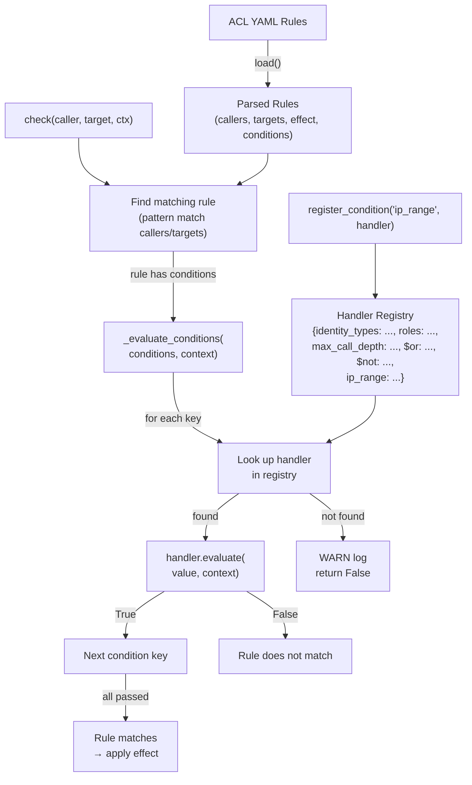

# ACL Conditions Redesign

> Feature spec for code-forge implementation planning.
> Source: extracted from docs/context-annotations-acl/tech-design.md §8
> Created: 2026-04-01

| Field | Value |
|-------|-------|
| Component | acl-conditions-redesign |
| Priority | P0 |
| SRS Refs | N/A (standalone mode) |
| Tech Design | §8.1 -- ACL Conditions Redesign row |
| Depends On | context-redesign |
| Blocks | -- |

## Purpose

Replaces the hardcoded ACL condition evaluation (if/else chain for 3 keys) with a pluggable handler registration system. Adds `$or` and `$not` compound operators, sync and async check paths, and fail-closed behavior for unknown conditions. This enables ecosystem packages and enterprise users to define custom ACL conditions (IP ranges, external auth, time-of-day) without modifying framework code.

## Scope

**Included:**
- `ACLConditionHandler` protocol/interface/trait definition (sync and async)
- `ACL.register_condition()` class-level registration API
- 5 built-in handlers: `identity_types`, `roles`, `max_call_depth`, `$or`, `$not`
- `_evaluate_conditions()` classmethod for recursive handler dispatch (AND logic)
- `_evaluate_conditions_async()` async variant
- `ACL.async_check()` method (new)
- Fail-closed behavior for unknown conditions (behavioral change)
- Rust: fix empty callers matching (align with Python/TS)
- Rust: move `audit_logger` to constructor parameter
- TypeScript: fix `removeRule` from JSON.stringify to element-wise comparison

**Excluded:**
- Policy language (Rego/CEL) integration
- Per-instance handler registries (global only)
- ACL rule CRUD changes (load/add/remove rule logic unchanged except TS removeRule fix)
- Audit logging format changes

## Core Responsibilities

1. **Handler protocol** -- Define `ACLConditionHandler` with `evaluate(value, context) -> bool` supporting both sync and async
2. **Handler registry** -- Global, thread-safe registry of condition handlers keyed by string
3. **Built-in handlers** -- 3 basic (identity_types, roles, max_call_depth) + 2 compound ($or, $not)
4. **Evaluation dispatch** -- Replace if/else chain with handler lookup and dispatch
5. **Async check** -- New `async_check()` that awaits async handlers
6. **Fail-closed** -- Unknown condition keys log WARN and return False

## Interfaces

### Inputs
- **ACL rule YAML** (configuration) -- Rules with `conditions` dict containing handler keys and values
- **ACLConditionHandler implementations** (user code) -- Custom handlers registered via `register_condition()`
- **Context** (runtime) -- Passed to `handler.evaluate()` for reading identity, data, call_chain

### Outputs
- **check() result** (`bool`) -- Allow (true) or deny (false)
- **async_check() result** (`bool` / `Promise<boolean>` / `Result<bool>`) -- Same, with async handler support
- **AuditEntry** (log record) -- Existing audit logging, unchanged

### Dependencies
- **Context** (context-redesign) -- Handlers read `context.identity`, `context.data`, `context.call_chain`
- **ACL class** (existing) -- Handler dispatch is integrated into existing check flow

## Data Flow



## Key Behaviors

### ACLConditionHandler Protocol -- Python

Two separate Protocol classes to handle sync and async variants cleanly:

```python
@runtime_checkable
class SyncACLConditionHandler(Protocol):
    def evaluate(self, value: Any, context: Context) -> bool: ...

@runtime_checkable
class AsyncACLConditionHandler(Protocol):
    async def evaluate(self, value: Any, context: Context) -> bool: ...

ACLConditionHandler = SyncACLConditionHandler | AsyncACLConditionHandler
```

**Why two Protocols:** A single Protocol cannot define `evaluate` as returning `bool | Coroutine[..., bool]` -- Python's typing system does not support union return types on Protocol methods. The dispatch logic uses `inspect.iscoroutinefunction(handler.evaluate)` to detect which variant.

### ACLConditionHandler -- TypeScript

```typescript
export interface ACLConditionHandler {
  evaluate(value: unknown, context: Context): boolean | Promise<boolean>;
}
```

**TypeScript simplification:** TS/JS naturally unifies sync and async returns. Dispatch always uses `await` (which is a no-op for plain boolean via `Promise.resolve()`).

### ACLConditionHandler -- Rust

```rust
#[async_trait]
pub trait ACLConditionHandler: Send + Sync {
    async fn evaluate(
        &self,
        value: &serde_json::Value,
        ctx: &Context<serde_json::Value>,
    ) -> bool;
}
```

**Rust simplification:** `async_trait` makes all handlers async. Sync handlers return immediately without `.await` internally. The compiler optimizes trivial async functions to zero-overhead.

### Registration API

```python
# Python -- class-level method
class ACL:
    _condition_handlers: ClassVar[dict[str, ACLConditionHandler]] = {}

    @classmethod
    def register_condition(cls, key: str, handler: ACLConditionHandler) -> None:
        """Register a condition handler. Replaces existing handler for same key."""
        cls._condition_handlers[key] = handler
```

```typescript
// TypeScript -- static method
class ACL {
  private static conditionHandlers = new Map<string, ACLConditionHandler>();

  static registerCondition(key: string, handler: ACLConditionHandler): void {
    ACL.conditionHandlers.set(key, handler);
  }
}
```

```rust
// Rust -- with RwLock for thread safety
use std::sync::RwLock;
use once_cell::sync::Lazy;

static CONDITION_HANDLERS: Lazy<RwLock<HashMap<String, Box<dyn ACLConditionHandler>>>> =
    Lazy::new(|| RwLock::new(HashMap::new()));

pub fn register_condition(key: impl Into<String>, handler: Box<dyn ACLConditionHandler>) {
    if let Ok(mut map) = CONDITION_HANDLERS.write() {
        map.insert(key.into(), handler);
    }
}
```

**Registration rules:**
- Global (class-level), not per-instance
- Registering same key twice replaces previous handler (no error)
- Thread-safe: Python uses class-level dict (GIL-protected), TS is single-threaded, Rust uses `RwLock`
- Can be called before or after `ACL.load()` -- handlers are resolved at `check()` time

### Built-in Handlers -- 3 Basic

**identity_types:** Check `context.identity.type` is in the allowed list.
```python
class _IdentityTypesHandler:
    def evaluate(self, value: Any, context: Context) -> bool:
        if not isinstance(value, list) or context.identity is None:
            return False
        return context.identity.type in value
```

**roles:** Check at least one role overlaps between identity and required roles.
```python
class _RolesHandler:
    def evaluate(self, value: Any, context: Context) -> bool:
        if not isinstance(value, list) or context.identity is None:
            return False
        return bool(set(context.identity.roles) & set(value))
```

**max_call_depth:** Check call chain length does not exceed threshold.
```python
class _MaxCallDepthHandler:
    def evaluate(self, value: Any, context: Context) -> bool:
        if not isinstance(value, int):
            return False
        return len(context.call_chain) <= value
```

**Value type validation:** Each handler validates its own `value` parameter type. If the type is wrong (e.g., `roles: 42` instead of `roles: ["admin"]`), the handler returns `False` (fail-closed). No exception is thrown.

### Built-in Handlers -- 2 Compound Operators

Compound handlers receive the evaluation function at construction time to avoid circular dependency:

```python
_EvalFn = Callable[[dict[str, Any], Context], bool]

class _OrHandler:
    """$or: list of condition dicts. Returns True if ANY sub-set passes."""
    def __init__(self, evaluate_fn: _EvalFn) -> None:
        self._evaluate = evaluate_fn

    def evaluate(self, value: Any, context: Context) -> bool:
        if not isinstance(value, list):
            return False
        for sub_conditions in value:
            if not isinstance(sub_conditions, dict):
                continue
            if self._evaluate(sub_conditions, context):
                return True
        return False

class _NotHandler:
    """$not: single condition dict. Returns True if the sub-set FAILS."""
    def __init__(self, evaluate_fn: _EvalFn) -> None:
        self._evaluate = evaluate_fn

    def evaluate(self, value: Any, context: Context) -> bool:
        if not isinstance(value, dict):
            return False
        return not self._evaluate(value, context)
```

**$or logic steps:**
1. Validate `value` is a list. If not, return `False`.
2. Iterate each element. Skip non-dict elements.
3. Call `_evaluate_conditions(sub_dict, context)` for each sub-condition dict.
4. If any sub-condition set passes (returns True), return `True`.
5. If none pass, return `False`.

**$not logic steps:**
1. Validate `value` is a dict. If not, return `False`.
2. Call `_evaluate_conditions(value, context)`.
3. Return the negation: `not result`.

**Auto-registration at module load:**
```python
ACL.register_condition("identity_types", _IdentityTypesHandler())
ACL.register_condition("roles", _RolesHandler())
ACL.register_condition("max_call_depth", _MaxCallDepthHandler())
ACL.register_condition("$or", _OrHandler(ACL._evaluate_conditions))
ACL.register_condition("$not", _NotHandler(ACL._evaluate_conditions))
```

### Condition Evaluation Dispatch -- Sync

```python
@classmethod
def _evaluate_conditions(
    cls, conditions: dict[str, Any], context: Context,
) -> bool:
    """Evaluate all conditions with AND logic. Fail-closed on unknown."""
    for key, value in conditions.items():
        handler = cls._condition_handlers.get(key)
        if handler is None:
            _logger.warning("Unknown ACL condition %r — treated as unsatisfied", key)
            return False
        result = handler.evaluate(value, context)
        if inspect.isawaitable(result):
            result.close()  # prevent "coroutine never awaited" warning
            _logger.warning(
                "Async condition %r in sync context — treated as unsatisfied. Use async_check().", key
            )
            return False
        if not result:
            return False
    return True
```

**Logic steps:**
1. Iterate `conditions.items()`.
2. Look up handler by key. If not found: log WARN, return `False` (fail-closed).
3. Call `handler.evaluate(value, context)`.
4. If result is awaitable (async handler in sync context): close the coroutine to prevent RuntimeWarning, log WARN, return `False`.
5. If result is `False`: return `False` (short-circuit AND).
6. If all conditions pass: return `True`.

### Condition Evaluation Dispatch -- Async

```python
@classmethod
async def _evaluate_conditions_async(
    cls, conditions: dict[str, Any], context: Context,
) -> bool:
    """Async variant. Awaits async handlers, calls sync handlers directly."""
    for key, value in conditions.items():
        handler = cls._condition_handlers.get(key)
        if handler is None:
            _logger.warning("Unknown ACL condition %r — treated as unsatisfied", key)
            return False
        result = handler.evaluate(value, context)
        if inspect.isawaitable(result):
            result = await result
        if not result:
            return False
    return True
```

**Design decision:** `_evaluate_conditions` and `_evaluate_conditions_async` have similar structure. This is intentional -- the sync variant MUST NOT import or reference the async runtime at the module level (for sync-only deployments). Do NOT merge them into a single function. (In Python this means avoiding top-level `asyncio` imports; equivalent rules apply to other languages with optional async runtimes.)

### Public API -- check() and async_check()

```python
class ACL:
    def check(self, caller_id: str | None, target_id: str,
              context: Context | None = None) -> bool:
        """Sync ACL check. Async handlers fail-closed. Returns bool."""
        # ...existing rule matching logic...
        # For each matching rule with conditions:
        #   if _evaluate_conditions(rule.conditions, context): apply effect
        ...

    async def async_check(self, caller_id: str | None, target_id: str,
                          context: Context | None = None) -> bool:
        """Async ACL check. Supports both sync and async handlers."""
        # ...same rule matching logic...
        # For each matching rule with conditions:
        #   if await _evaluate_conditions_async(rule.conditions, context): apply effect
        ...
```

```typescript
class ACL {
  check(callerId: string | null, targetId: string, context?: Context | null): boolean { ... }
  async asyncCheck(callerId: string | null, targetId: string, context?: Context | null): Promise<boolean> { ... }
}
```

```rust
impl ACL {
    pub fn check(&self, caller_id: Option<&str>, target_id: &str,
                 ctx: Option<&Context<serde_json::Value>>) -> Result<bool, ModuleError> { ... }
    pub async fn async_check(&self, caller_id: Option<&str>, target_id: &str,
                             ctx: Option<&Context<serde_json::Value>>) -> Result<bool, ModuleError> { ... }
}
```

**Return type differences:**
- Python/TypeScript: return `bool` directly. Raise/throw only on internal error (lock poisoning, etc.), not for deny decisions.
- Rust: return `Result<bool, ModuleError>`. `Ok(false)` means deny, `Err(...)` means internal error. This aligns with Rust error handling conventions.

### TypeScript removeRule Fix

**Current (broken):** Uses `JSON.stringify` for comparison, which is order-sensitive.
```typescript
// BEFORE (order-dependent)
removeRule(rule: ACLRule): boolean {
  const idx = this.rules.findIndex(r => JSON.stringify(r) === JSON.stringify(rule));
  ...
}
```

**After:** Element-wise comparison.
```typescript
// AFTER (order-independent)
removeRule(rule: ACLRule): boolean {
  const idx = this.rules.findIndex(r =>
    arraysEqual(r.callers, rule.callers) &&
    arraysEqual(r.targets, rule.targets) &&
    r.effect === rule.effect &&
    r.description === rule.description &&
    deepEqual(r.conditions, rule.conditions)
  );
  ...
}
```

### Rust Empty Callers Fix

**Current (broken):** Empty `callers` list matches all callers.
```rust
// BEFORE: empty callers acts as wildcard
if rule.callers.is_empty() || rule.callers.iter().any(|p| match_pattern(p, caller_id)) { ... }
```

**After:** Empty callers matches nothing (align with Python/TS).
```rust
// AFTER: empty callers matches nothing
if rule.callers.iter().any(|p| match_pattern(p, caller_id)) { ... }
```

### Rust audit_logger Move to Constructor

**Current:** Setter method `set_audit_logger()`.
**After:** Constructor parameter.

```rust
// BEFORE
let mut acl = ACL::new();
acl.set_audit_logger(some_logger);

// AFTER
let acl = ACL::new(Some(audit_logger));
// or with builder pattern:
let acl = ACL::builder().audit_logger(some_logger).build();
```

## Constraints

- **Compound + async limitation**: `$or` and `$not` in sync `check()` call the sync `_evaluate_conditions`, so async sub-conditions fail-closed. Use `async_check()` for async conditions in compound operators.
- **Global registry**: Handler registry is global (class-level). Cannot have per-ACL-instance registries. This is sufficient for library use but limiting for multi-tenant test scenarios. Workaround: register/unregister in test setup/teardown.
- **Handler thread safety**: Handlers registered via `register_condition()` must themselves be thread-safe if used in async contexts. The framework does not enforce this.

## Acceptance Criteria

| AC-ID | Criterion | Verification Method |
|-------|-----------|---------------------|
| AC-009 | `register_condition()` registers handler invoked during `check()` | Integration test: register custom handler, write rule, verify handler called |
| AC-010 | Unknown condition key fails-closed with WARN log | Unit test: rule with `{"nonexistent": true}`, check returns deny, WARN logged |
| AC-011 | `$or` evaluates with OR logic | Unit test: `$or: [{roles: ["admin"]}, {identity_types: ["service"]}]`, passes for admin user |
| AC-012 | `$not` negates condition set | Unit test: `$not: {identity_types: ["service"]}`, allows user, denies service |
| AC-013 | `async_check()` awaits async handlers | Unit test: register async handler, `async_check()` returns correct result |
| AC-014 | Sync `check()` fails-closed on async handlers | Unit test: register async handler, sync `check()` logs WARN, returns deny |
| AC-029 | `$or` with empty list returns False | Unit test: `$or: []`, check returns False |
| AC-030 | `$not` with non-dict value returns False | Unit test: `$not: "invalid"`, check returns False |
| AC-031 | Handler replacement: registering same key twice replaces handler | Unit test: register handler A for "k", then handler B for "k", verify B is called |
| AC-032 | Nested compound: `$or: [{roles: ["admin"]}, {identity_types: ["service"], max_call_depth: 5}]` | Unit test: verify AND within sub-dict and OR across sub-dicts |
| AC-033 | Rust empty callers no longer matches all | Unit test: rule with `callers: []`, check returns no match |
| AC-034 | TS `removeRule` with reordered fields succeeds | Unit test: add rule, remove with same fields in different order, verify removed |
| AC-035 | Rust `audit_logger` passed at constructor | Unit test: construct ACL with logger, verify logger receives entries |

## Error Handling

| Error Condition | Behavior | Language |
|----------------|----------|----------|
| Unknown condition key | Log WARN, return False (fail-closed) | All |
| Async handler in sync check | Close coroutine, log WARN, return False | Python |
| Async handler in sync check | N/A (TS always uses await) | TypeScript |
| Async handler in sync check | Block on runtime (not recommended) | Rust |
| Handler raises/throws/panics | Caught, logged as ERROR, return False (fail-closed) | All |
| Lock poisoned (Rust) | `unwrap_or_else` to recover, or propagate as `ModuleError` | Rust |
| `context` is None for identity-based condition | Handler returns False (identity required) | All |
| Malformed `conditions` value (wrong type for handler) | Handler returns False (internal type validation) | All |

## File Structure

```
apcore-python/src/apcore/
├── acl.py                        # ACL class (modify: add registry, dispatch, async_check, fail-closed)
└── acl_handlers.py               # NEW: Built-in handler classes + compound operators

apcore-typescript/src/
├── acl.ts                        # ACL class (modify: add registry, dispatch, asyncCheck, removeRule fix)
└── acl-handlers.ts               # NEW: Built-in handler classes + compound operators

apcore-rust/src/
├── acl.rs                        # ACL struct (modify: add registry, dispatch, async_check, empty callers fix, audit_logger constructor)
└── acl_handlers.rs               # NEW: Built-in handler structs + compound operators
```

## Test Module

**Test files:**
- Python: `apcore-python/tests/test_acl_conditions.py`
- TypeScript: `apcore-typescript/tests/acl-conditions.test.ts`
- Rust: `apcore-rust/tests/acl_conditions_test.rs`

**Test scope:**
- **Unit**: Each built-in handler in isolation (identity_types, roles, max_call_depth, $or, $not), `register_condition()`, `_evaluate_conditions()`, fail-closed behavior, async handler in sync context, handler replacement
- **Integration**: Full `check()` and `async_check()` with YAML rules, custom handlers, compound conditions
- **Fixtures / Mocks**: `Context` with test identity (roles, type), mock async handler (returns after delay), YAML rules with various condition combinations
