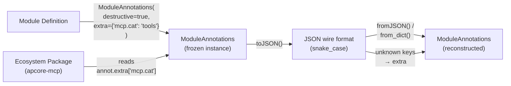

# Annotations Redesign

> Feature spec for code-forge implementation planning.
> Source: extracted from docs/context-annotations-acl/tech-design.md §8
> Created: 2026-04-01

| Field | Value |
|-------|-------|
| Component | annotations-redesign |
| Priority | P0 |
| SRS Refs | N/A (standalone mode) |
| Tech Design | §8.1 -- Annotations Redesign row |
| Depends On | -- |
| Blocks | -- |

## Purpose

Adds an `extra` extension dictionary to `ModuleAnnotations` for ecosystem package metadata, changes `pagination_style` from enum to open string, introduces a canonical snake_case wire format for JSON serialization, and provides a `createAnnotations()` factory in TypeScript. This enables ecosystem packages (apcore-mcp, apcore-cli, apcore-a2a) to store custom annotations without modifying the core type.

## Scope

**Included:**
- Add `extra: map[string, any]` field to ModuleAnnotations in all 3 SDKs
- Change `pagination_style` from `Literal[...]` (Python) / union type (TS) to `str` / `string`
- Python: `cache_key_fields` stored as `tuple[str, ...] | None`, `extra` shallow-copied in `__post_init__`
- TypeScript: 5 optional fields become required with defaults; `createAnnotations()` factory
- TypeScript: `toJSON()` / `fromJSON()` with snake_case wire format
- Rust: `#[serde(flatten)]` on `extra` for automatic unknown key capture
- All: `DEFAULT_ANNOTATIONS` constant
- Ecosystem migration: apcore-cli `approval_message` -> `extra["cli.approval_message"]`
- Forward compatibility: unknown top-level keys in deserialized JSON placed into `extra`

**Excluded:**
- Schema validation for `extra` values (consumer's responsibility)
- New annotation fields beyond `extra`
- Changes to how Executor reads annotations (existing behavior unchanged)

## Core Responsibilities

1. **Extra field** -- Provide an open dict for ecosystem packages to store custom metadata
2. **Wire format** -- Canonical snake_case JSON serialization/deserialization with forward compatibility
3. **TypeScript factory** -- `createAnnotations()` accepting `Partial<ModuleAnnotations>` to ease migration from optional to required fields
4. **Immutability enforcement** -- Python frozen dataclass with `__post_init__` for list-to-tuple and dict copy

## Interfaces

### Inputs
- **Module class definition** (developer code) -- Sets `annotations = ModuleAnnotations(...)` on module class
- **JSON wire data** (cross-process) -- Serialized annotations from another SDK or process

### Outputs
- **ModuleAnnotations instance** -- Frozen/immutable object with 12 fields including `extra`
- **JSON wire format** -- snake_case JSON string

### Dependencies
- **None** -- ModuleAnnotations is self-contained

## Data Flow



## Key Behaviors

### Python ModuleAnnotations Update

```python
@dataclass(frozen=True)
class ModuleAnnotations:
    readonly: bool = False
    destructive: bool = False
    idempotent: bool = False
    requires_approval: bool = False
    open_world: bool = True
    streaming: bool = False
    cacheable: bool = False
    cache_ttl: int = 0
    cache_key_fields: tuple[str, ...] | None = None
    paginated: bool = False
    pagination_style: str = "cursor"        # Changed from Literal[...] to str
    extra: dict[str, Any] = field(default_factory=dict)  # NEW

    def __post_init__(self) -> None:
        # Convert list to tuple for cache_key_fields (frozen dataclass)
        if isinstance(self.cache_key_fields, list):
            object.__setattr__(self, "cache_key_fields", tuple(self.cache_key_fields))
        # Shallow copy extra to detach from caller's mutable dict
        object.__setattr__(self, "extra", dict(self.extra))
        # Validate cache_ttl
        if self.cache_ttl < 0:
            import logging
            logging.getLogger(__name__).warning("cache_ttl %d is negative, clamping to 0", self.cache_ttl)
            object.__setattr__(self, "cache_ttl", 0)
```

**Logic steps for `__post_init__`:**
1. Check if `cache_key_fields` is a `list`. If so, convert to `tuple` via `object.__setattr__` (bypass frozen restriction).
2. Shallow-copy `extra` dict via `dict(self.extra)` to detach from caller's mutable reference. Use `object.__setattr__` to set on frozen instance.
3. Validate `cache_ttl >= 0`. If negative, log WARN and clamp to 0.

### Python from_dict Classmethod (Deserialization)

```python
_CANONICAL_FIELDS = {
    "readonly", "destructive", "idempotent", "requires_approval",
    "open_world", "streaming", "cacheable", "cache_ttl",
    "cache_key_fields", "paginated", "pagination_style", "extra",
}

@classmethod
def from_dict(cls, data: dict[str, Any]) -> "ModuleAnnotations":
    """Deserialize from dict, capturing unknown keys into extra."""
    known = {k: v for k, v in data.items() if k in cls._CANONICAL_FIELDS}
    unknown = {k: v for k, v in data.items() if k not in cls._CANONICAL_FIELDS}
    explicit_extra = known.pop("extra", {})
    extra = {**explicit_extra, **unknown}
    return cls(**known, extra=extra)
```

**Logic steps:**
1. Separate `data` into known fields (in `_CANONICAL_FIELDS`) and unknown fields.
2. Extract explicit `extra` from known (or default to `{}`).
3. Merge explicit extra with unknown overflow keys (unknown keys take precedence if duplicated -- unlikely since they come from different sources).
4. Construct `ModuleAnnotations` with known fields + merged extra.

### TypeScript ModuleAnnotations Update

```typescript
export interface ModuleAnnotations {
  readonly readonly: boolean;
  readonly destructive: boolean;
  readonly idempotent: boolean;
  readonly requiresApproval: boolean;
  readonly openWorld: boolean;
  readonly streaming: boolean;
  readonly cacheable: boolean;
  readonly cacheTtl: number;
  readonly cacheKeyFields: readonly string[] | null;
  readonly paginated: boolean;
  readonly paginationStyle: string;                    // Changed from union to string
  readonly extra: Readonly<Record<string, unknown>>;   // NEW
}

export const DEFAULT_ANNOTATIONS: ModuleAnnotations = Object.freeze({
  readonly: false,
  destructive: false,
  idempotent: false,
  requiresApproval: false,
  openWorld: true,
  streaming: false,
  cacheable: false,
  cacheTtl: 0,
  cacheKeyFields: null,
  paginated: false,
  paginationStyle: 'cursor',
  extra: Object.freeze({}),
});

export function createAnnotations(
  overrides?: Partial<ModuleAnnotations>,
): ModuleAnnotations {
  return Object.freeze({
    ...DEFAULT_ANNOTATIONS,
    ...overrides,
    extra: Object.freeze({ ...(overrides?.extra ?? {}) }),
  });
}
```

**`createAnnotations()` logic:**
1. Spread `DEFAULT_ANNOTATIONS` (all 12 fields with defaults).
2. Spread `overrides` on top (only non-default values need to be passed).
3. For `extra`, always create a new frozen object from overrides (replaces, does not merge with default's empty `{}`). Callers who want to merge must spread explicitly.
4. `Object.freeze()` the result for immutability.

**Breaking change note:** TypeScript previously had 5 optional fields (`cacheable?`, `cacheTtl?`, etc.). These become required. The `createAnnotations()` factory mitigates this: callers switch from `{ readonly: true }` (with missing fields) to `createAnnotations({ readonly: true })` (fills defaults).

### TypeScript toJSON / fromJSON

```typescript
// Instance method on ModuleAnnotations (or standalone function)
export function annotationsToJSON(a: ModuleAnnotations): Record<string, unknown> {
  return {
    readonly: a.readonly,
    destructive: a.destructive,
    idempotent: a.idempotent,
    requires_approval: a.requiresApproval,     // camelCase → snake_case
    open_world: a.openWorld,
    streaming: a.streaming,
    cacheable: a.cacheable,
    cache_ttl: a.cacheTtl,
    cache_key_fields: a.cacheKeyFields,
    paginated: a.paginated,
    pagination_style: a.paginationStyle,
    extra: a.extra,
  };
}

const KNOWN_WIRE_KEYS = new Set([
  'readonly', 'destructive', 'idempotent', 'requires_approval',
  'open_world', 'streaming', 'cacheable', 'cache_ttl',
  'cache_key_fields', 'paginated', 'pagination_style', 'extra',
]);

export function annotationsFromJSON(data: Record<string, unknown>): ModuleAnnotations {
  const explicitExtra = (data['extra'] as Record<string, unknown>) ?? {};
  const overflow: Record<string, unknown> = {};
  for (const [k, v] of Object.entries(data)) {
    if (!KNOWN_WIRE_KEYS.has(k)) overflow[k] = v;
  }

  return Object.freeze({
    readonly: (data['readonly'] as boolean) ?? false,
    destructive: (data['destructive'] as boolean) ?? false,
    idempotent: (data['idempotent'] as boolean) ?? false,
    requiresApproval: (data['requires_approval'] as boolean) ?? false,
    openWorld: (data['open_world'] as boolean) ?? true,
    streaming: (data['streaming'] as boolean) ?? false,
    cacheable: (data['cacheable'] as boolean) ?? false,
    cacheTtl: (data['cache_ttl'] as number) ?? 0,
    cacheKeyFields: (data['cache_key_fields'] as string[] | null) ?? null,
    paginated: (data['paginated'] as boolean) ?? false,
    paginationStyle: (data['pagination_style'] as string) ?? 'cursor',
    extra: Object.freeze({ ...explicitExtra, ...overflow }),
  });
}
```

**Field mapping table (TS internal -> wire format):**

| TypeScript (camelCase) | Wire JSON (snake_case) |
|----------------------|---------------------|
| `readonly` | `readonly` |
| `destructive` | `destructive` |
| `idempotent` | `idempotent` |
| `requiresApproval` | `requires_approval` |
| `openWorld` | `open_world` |
| `streaming` | `streaming` |
| `cacheable` | `cacheable` |
| `cacheTtl` | `cache_ttl` |
| `cacheKeyFields` | `cache_key_fields` |
| `paginated` | `paginated` |
| `paginationStyle` | `pagination_style` |
| `extra` | `extra` |

### Rust ModuleAnnotations Update

```rust
#[derive(Debug, Clone, Serialize, Deserialize)]
pub struct ModuleAnnotations {
    #[serde(default)]
    pub readonly: bool,
    #[serde(default)]
    pub destructive: bool,
    #[serde(default)]
    pub idempotent: bool,
    #[serde(default)]
    pub requires_approval: bool,
    #[serde(default = "default_true")]
    pub open_world: bool,
    #[serde(default)]
    pub streaming: bool,
    #[serde(default)]
    pub cacheable: bool,
    #[serde(default)]
    pub cache_ttl: u64,
    #[serde(default)]
    pub cache_key_fields: Option<Vec<String>>,
    #[serde(default)]
    pub paginated: bool,
    #[serde(default = "default_cursor")]
    pub pagination_style: String,
    #[serde(default, flatten)]              // NEW: captures unknown keys
    pub extra: HashMap<String, serde_json::Value>,
}

fn default_true() -> bool { true }
fn default_cursor() -> String { "cursor".into() }

impl Default for ModuleAnnotations {
    fn default() -> Self {
        Self {
            readonly: false, destructive: false, idempotent: false,
            requires_approval: false, open_world: true, streaming: false,
            cacheable: false, cache_ttl: 0, cache_key_fields: None,
            paginated: false, pagination_style: "cursor".into(),
            extra: HashMap::new(),
        }
    }
}
```

**Rust-specific notes:**
- `#[serde(flatten)]` on `extra` automatically captures unknown JSON keys during deserialization. This provides forward compatibility without custom deserialization code.
- `cache_ttl: u64` is inherently non-negative (no validation needed).
- `pagination_style: String` (already a String in Rust, no change needed).

### Extra Key Naming Convention

| Pattern | Owner | Example |
|---------|-------|---------|
| `{package}.{key}` | Ecosystem package | `mcp.category`, `a2a.guidance`, `cli.approval_message` |
| `{app}.{key}` | User application | `myapp.cost_center`, `myapp.team` |

Rules:
- Extra keys SHOULD use `{namespace}.{key}` format to avoid collisions
- Unprefixed keys are allowed but SHOULD NOT be used by ecosystem packages
- No schema validation of extra values -- consuming code validates as needed

### Ecosystem Package Migration

**apcore-cli:** Currently reads `approval_message` via duck-typing workaround.
- Before: `annotations.approval_message` (non-existent field, duck-typed)
- After: `annotations.extra.get("cli.approval_message")` (Python) / `annotations.extra['cli.approval_message']` (TS) / `annotations.extra.get("cli.approval_message")` (Rust)

**apcore-mcp:** May store `mcp.category`, `mcp.icon` in `extra`.
- Read via: `annotations.extra.get("mcp.category", "default")`

**apcore-a2a:** May store `a2a.guidance` in `extra`.
- Read via: `annotations.extra.get("a2a.guidance")`

## Constraints

- **Frozen dataclass (Python)**: `__post_init__` must use `object.__setattr__` to mutate fields on frozen instance. This is a standard Python pattern.
- **Object.freeze (TypeScript)**: `createAnnotations()` returns frozen object. Mutation attempts throw in strict mode, fail silently in non-strict mode.
- **serde(flatten) (Rust)**: `#[serde(flatten)]` has minor performance overhead due to intermediate buffering during deserialization. Acceptable for annotations (serialized once per module registration, not per-call).

## Acceptance Criteria

| AC-ID | Criterion | Verification Method |
|-------|-----------|---------------------|
| AC-005 | `ModuleAnnotations.extra` exists with default `{}` in all 3 SDKs | Unit test: default-construct, assert `extra` is empty dict/map |
| AC-006 | Unknown top-level keys in deserialized JSON placed into `extra` | Unit test: deserialize `{"readonly": true, "future_field": 42}`, assert `extra["future_field"] == 42` |
| AC-007 | `pagination_style` accepts arbitrary strings | Unit test: construct with `pagination_style="custom"`, no error |
| AC-008 | `createAnnotations()` fills defaults for unspecified fields | Unit test: `createAnnotations({destructive: true})`, assert `readonly` is `false`, `openWorld` is `true` |
| AC-022 | Python `cache_key_fields` stored as `tuple` even when passed as `list` | Unit test: construct with `cache_key_fields=["a", "b"]`, assert `isinstance(cache_key_fields, tuple)` |
| AC-023 | Python `extra` dict is detached from caller's mutable dict | Unit test: `d = {"k": "v"}; ma = ModuleAnnotations(extra=d); d["k2"] = "v2"; assert "k2" not in ma.extra` |
| AC-024 | `toJSON()` produces snake_case keys | Unit test: `requiresApproval: true` serializes as `requires_approval: true` |
| AC-025 | `fromJSON()` converts snake_case to camelCase internally | Unit test: parse `{"requires_approval": true}`, assert `requiresApproval === true` |
| AC-026 | Round-trip: `fromJSON(toJSON(annotations))` preserves all fields | Unit test: construct with extra, toJSON, fromJSON, deep equality check |
| AC-027 | Negative `cache_ttl` clamped to 0 with WARN log (Python/TS) | Unit test: construct with `cache_ttl=-5`, assert `cache_ttl == 0` |
| AC-028 | Rust `#[serde(flatten)]` captures unknown JSON keys into `extra` | Unit test: deserialize JSON with `"future_field": 42`, assert `extra["future_field"]` |

## Error Handling

| Error Condition | Behavior | Language |
|----------------|----------|----------|
| `cache_ttl` negative | Clamp to 0, log WARN | Python, TypeScript |
| `cache_ttl` negative | N/A (u64 cannot be negative) | Rust |
| `extra` value not serializable | Error at serialization time (not at construction) | All |
| `from_dict()` / `fromJSON()` with missing fields | Use defaults for missing fields | All |
| `from_dict()` with non-dict value for `extra` | Treat as empty dict (ignore malformed) | All |

## File Structure

```
apcore-python/src/apcore/
└── module.py                     # ModuleAnnotations class (modify: add extra, __post_init__, from_dict)

apcore-typescript/src/
├── module.ts                     # ModuleAnnotations interface (modify: add extra, required fields)
├── annotations.ts                # NEW: createAnnotations(), toJSON(), fromJSON(), DEFAULT_ANNOTATIONS
└── index.ts                      # Re-export new functions

apcore-rust/src/
└── module.rs                     # ModuleAnnotations struct (modify: add extra with serde(flatten))
```

## Test Module

**Test files:**
- Python: `apcore-python/tests/test_annotations.py`
- TypeScript: `apcore-typescript/tests/annotations.test.ts`
- Rust: `apcore-rust/tests/annotations_test.rs`

**Test scope:**
- **Unit**: `ModuleAnnotations()` construction with extra, `from_dict()` / `fromJSON()` with unknown keys, `toJSON()` snake_case conversion, `createAnnotations()` factory, `cache_key_fields` tuple coercion, `extra` dict detachment, negative `cache_ttl` clamping, round-trip serialization
- **Integration**: Ecosystem package reading `extra["cli.approval_message"]` from a module's annotations
- **Fixtures / Mocks**: `ModuleAnnotations` instances with various extra key combinations
