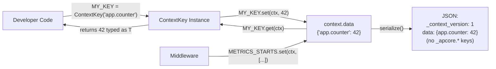

# Context Redesign

> Feature spec for code-forge implementation planning.
> Source: extracted from docs/context-annotations-acl/tech-design.md §8
> Created: 2026-04-01

| Field | Value |
|-------|-------|
| Component | context-redesign |
| Priority | P0 |
| SRS Refs | N/A (standalone mode) |
| Tech Design | §8.1 -- Context Redesign row |
| Depends On | -- |
| Blocks | acl-conditions-redesign |

## Purpose

Aligns the Context struct/class across Python, TypeScript, and Rust SDKs to a single canonical field definition, introduces `ContextKey<T>` for type-safe access to `context.data`, fixes data key naming convention violations, and adds `_context_version` serialization support. This is the foundational component that the ACL redesign depends on (handlers read from Context).

## Scope

**Included:**
- `ContextKey<T>` class/struct in all 3 SDKs with `get()`, `set()`, `delete()`, `exists()`, `scoped()`
- Built-in context key constants (`_apcore.mw.*`, `_apcore.executor.*`)
- Data key naming migration (`_metrics_starts` -> `_apcore.mw.metrics.starts`, etc.)
- Context serialization with `_context_version: 1` and data key filtering
- Rust: remove `created_at`, `parent_trace_id`, `trace_context` fields
- Rust: change `global_deadline` from `Option<Instant>` to `Option<f64>` (epoch seconds)
- Rust: make `Identity` fields immutable (private fields + pub getters)
- TypeScript: add `globalDeadline: number | null` field

**Excluded:**
- Changes to `Context.create()` or `Context.child()` logic (unchanged)
- Distributed context synchronization
- Thread-safety for `context.data` in Python/TS
- ContextKey runtime enforcement of `_apcore.*` prefix restriction

## Core Responsibilities

1. **ContextKey<T> typed accessor** -- Provide a generic type that reads/writes `context.data` entries with type safety at the IDE/compiler level
2. **Built-in key constants** -- Export framework-internal keys as typed constants for middleware authors
3. **Data key naming fix** -- Rename existing internal keys from legacy names to `_apcore.*` convention
4. **Serialization protocol** -- Serialize Context to JSON with `_context_version`, exclude non-serializable fields, filter `_`-prefixed data keys
5. **Cross-language field alignment** -- Remove/add fields per SDK to match canonical definition

## Interfaces

### Inputs
- **context.data** (dict/map) -- The existing untyped key-value bag that ContextKey wraps

### Outputs
- **ContextKey<T>** (new type) -- Exported from each SDK for module/middleware authors
- **Built-in key constants** (module-level constants) -- Exported for internal middleware use
- **Serialized Context JSON** (string) -- Produced by `serialize()` or equivalent

### Dependencies
- **Context class** (existing) -- ContextKey wraps access to `context.data`
- **serde/serde_json** (Rust only) -- For serialization/deserialization

## Data Flow



## Key Behaviors

### ContextKey<T> -- Python Implementation

```python
@dataclass(frozen=True)
class ContextKey(Generic[T]):
    """Typed key for context.data with namespace isolation."""
    name: str

    def get(self, ctx: Context, default: T | None = None) -> T | None:
        _MISSING = object()
        value = ctx.data.get(self.name, _MISSING)
        return default if value is _MISSING else value  # type: ignore[return-value]

    def set(self, ctx: Context, value: T) -> None:
        ctx.data[self.name] = value

    def delete(self, ctx: Context) -> None:
        ctx.data.pop(self.name, None)

    def exists(self, ctx: Context) -> bool:
        return self.name in ctx.data

    def scoped(self, suffix: str) -> "ContextKey[T]":
        return ContextKey(f"{self.name}.{suffix}")
```

**Logic steps:**
1. `get()`: Look up `self.name` in `ctx.data`. Use a `_MISSING` sentinel (not `None`) to distinguish "key absent" from "value is None". If absent, return `default`. If present, return the value (type-ignored because `dict.get()` returns `Any`).
2. `set()`: Direct dict assignment `ctx.data[self.name] = value`.
3. `delete()`: `ctx.data.pop(self.name, None)` -- no-op if absent, no KeyError.
4. `exists()`: `self.name in ctx.data` -- standard dict membership test.
5. `scoped()`: Return new `ContextKey` with name `"{self.name}.{suffix}"`. This allocates a new instance.

### ContextKey<T> -- TypeScript Implementation

```typescript
export class ContextKey<T> {
  constructor(readonly name: string) {}

  get(ctx: Context, defaultValue?: T): T | undefined {
    const val = ctx.data[this.name];
    return val !== undefined ? (val as T) : defaultValue;
  }

  set(ctx: Context, value: T): void { ctx.data[this.name] = value; }
  delete(ctx: Context): void { delete ctx.data[this.name]; }
  exists(ctx: Context): boolean { return this.name in ctx.data; }
  scoped(suffix: string): ContextKey<T> { return new ContextKey(`${this.name}.${suffix}`); }
}
```

**TypeScript-specific note:** `val !== undefined` is used instead of a sentinel. This means a value of `undefined` stored in data is treated as absent. This is acceptable because `undefined` should not be stored in a shared data bag (it does not serialize to JSON).

### ContextKey<T> -- Rust Implementation

```rust
pub struct ContextKey<T> {
    pub name: Cow<'static, str>,
    _marker: PhantomData<T>,
}

impl<T> ContextKey<T> {
    pub const fn new(name: &'static str) -> Self {
        Self { name: Cow::Borrowed(name), _marker: PhantomData }
    }
    pub fn scoped(&self, suffix: &str) -> ContextKey<T> {
        ContextKey { name: Cow::Owned(format!("{}.{}", self.name, suffix)), _marker: PhantomData }
    }
}

impl<T: serde::de::DeserializeOwned> ContextKey<T> {
    pub fn get(&self, ctx: &Context<impl std::any::Any>) -> Option<T> {
        let map = ctx.data.read().ok()?;
        let val = map.get(self.name.as_ref())?;
        serde_json::from_value(val.clone()).ok()
    }
}

impl<T: serde::Serialize> ContextKey<T> {
    pub fn set(&self, ctx: &Context<impl std::any::Any>, value: T) {
        if let Ok(mut map) = ctx.data.write() {
            if let Ok(v) = serde_json::to_value(value) {
                map.insert(self.name.to_string(), v);
            }
        }
    }
}
```

**Rust-specific notes:**
- `Cow<'static, str>` allows static keys (`const fn new`) to be zero-allocation. Only `scoped()` allocates.
- `get()` requires `DeserializeOwned`, `set()` requires `Serialize` -- separate `impl` blocks because a key may only be read or only be written.
- `get()` reads through `RwLock` on `context.data` (shared data is `Arc<RwLock<HashMap>>`).
- `set()` writes through `RwLock`. If the lock is poisoned, the operation silently fails (returns `()` without panic).

### Built-in Context Keys

Defined in a dedicated module per SDK:

```python
# Python -- apcore/context_keys.py
from apcore.context_key import ContextKey

# Direct keys
TRACING_SPANS    = ContextKey[list]("_apcore.mw.tracing.spans")
TRACING_SAMPLED  = ContextKey[bool]("_apcore.mw.tracing.sampled")
METRICS_STARTS   = ContextKey[list]("_apcore.mw.metrics.starts")
LOGGING_START    = ContextKey[float]("_apcore.mw.logging.start_time")
REDACTED_OUTPUT  = ContextKey[dict]("_apcore.executor.redacted_output")

# Base keys (use .scoped(module_id) for per-module sub-keys)
RETRY_COUNT_BASE = ContextKey[int]("_apcore.mw.retry.count")
```

**Naming convention for base keys:** Keys that are always scoped per-module are suffixed with `_BASE` to signal that they should not be used directly without `.scoped()`.

### Data Key Naming Migration

| Old Key | New Key | Location |
|---------|---------|----------|
| `_metrics_starts` | `_apcore.mw.metrics.starts` | Metrics middleware |
| `_usage_starts` | `_apcore.mw.usage.starts` | Usage middleware |
| `_obs_logging_starts` | `_apcore.mw.logging.starts` | Logging middleware |

**Migration steps:**
1. Update the key constant definition to use new name
2. Update all middleware code that reads/writes the key to use the `ContextKey` constant
3. No backward compatibility needed -- these are internal framework keys not exposed to user code

### Context Serialization

**Serialization rules:**
1. Include `_context_version: 1` as a top-level field (peer of `trace_id`, `caller_id`, etc.)
2. Exclude fields: `executor`, `services`, `cancel_token`, `global_deadline` (marked MUST NOT serialize)
3. Within `data` dict: filter out keys starting with `_` (framework-internal keys)
4. Include: `trace_id`, `caller_id`, `call_chain`, `identity` (with nested id/type/roles/attrs), `redacted_inputs`, `data` (filtered)

**Deserialization rules:**
1. Read `_context_version` from top level. If > current version, log WARN but proceed.
2. Unknown top-level fields MUST be preserved (forward compatibility).
3. Reconstruct Context with deserialized fields. `executor`, `services`, `cancel_token`, `global_deadline` are `None`/`null`/`None` after deserialization.

```python
# Python serialization (illustrative)
def serialize(self) -> dict:
    result = {
        "_context_version": 1,
        "trace_id": self.trace_id,
        "caller_id": self.caller_id,
        "call_chain": list(self.call_chain),
    }
    if self.identity is not None:
        result["identity"] = {
            "id": self.identity.id,
            "type": self.identity.type,
            "roles": list(self.identity.roles),
            "attrs": dict(self.identity.attrs),
        }
    if self.redacted_inputs is not None:
        result["redacted_inputs"] = self.redacted_inputs
    # Filter _-prefixed keys from data
    result["data"] = {k: v for k, v in self.data.items() if not k.startswith("_")}
    return result
```

### Rust Identity Immutability Fix

**Current (broken):** `pub` fields allow mutation after construction.
```rust
// BEFORE -- fields are pub, violating immutability spec
pub struct Identity {
    pub id: String,
    pub identity_type: String,
    pub roles: Vec<String>,
    pub attrs: HashMap<String, serde_json::Value>,
}
```

**After:** Private fields with constructor and pub getters.
```rust
// AFTER -- fields are private, getters return shared references
pub struct Identity {
    id: String,
    identity_type: String,
    roles: Vec<String>,
    attrs: HashMap<String, serde_json::Value>,
}

impl Identity {
    pub fn new(
        id: String,
        identity_type: String,
        roles: Vec<String>,
        attrs: HashMap<String, serde_json::Value>,
    ) -> Self {
        Self { id, identity_type, roles, attrs }
    }

    pub fn id(&self) -> &str { &self.id }
    pub fn identity_type(&self) -> &str { &self.identity_type }
    pub fn roles(&self) -> &[String] { &self.roles }
    pub fn attrs(&self) -> &HashMap<String, serde_json::Value> { &self.attrs }
}
```

**Serde compatibility:** Add `#[serde(rename = "type")]` on `identity_type` field. Custom `Deserialize` impl needed since fields are private, or use `#[derive(Deserialize)]` with `#[serde(from = "IdentityRaw")]` pattern (deserialize into a raw struct, convert via `Identity::new()`).

### Rust Field Removal

Remove three non-spec fields from `Context<T>`:

| Field | Current Type | Action | Migration Path |
|-------|-------------|--------|---------------|
| `created_at` | `DateTime<Utc>` | Remove | Use `data["_apcore.created_at"]` via ContextKey if needed |
| `parent_trace_id` | `Option<String>` | Remove | Derive from `call_chain[0]` or use `data` |
| `trace_context` | `Option<TraceContext>` | Remove | Move to `data["_apcore.trace_context"]` |

Also remove the `chrono` and `TraceContext` imports from `context.rs` if they become unused.

### TypeScript globalDeadline Addition

```typescript
// Add to Context class
readonly globalDeadline: number | null;

// In constructor:
constructor(
    // ...existing params...
    globalDeadline: number | null = null,
) {
    // ...existing assignments...
    this.globalDeadline = globalDeadline;
}
```

`globalDeadline` is `number | null` (epoch seconds as float). It is NOT serialized (matches Python/Rust behavior where `global_deadline` is excluded from serialization).

## Constraints

- **No runtime prefix enforcement**: `_apcore.*` prefix is convention-only. Runtime checking is deferred per OQ-001.
- **Rust RwLock**: ContextKey `get()`/`set()` go through `RwLock`. If the lock is poisoned (due to panic in another thread), operations silently fail. This matches the existing `SharedData` behavior.
- **Type erasure**: ContextKey provides type safety at compile time (IDE/type checker) but stores values as `Any`/`unknown`/`serde_json::Value` at runtime. A `ContextKey[int]` can technically store a string if the user bypasses the key and writes to `data` directly.

## Acceptance Criteria

| AC-ID | Criterion | Verification Method |
|-------|-----------|---------------------|
| AC-001 | `ContextKey.get()` returns typed value from `context.data` | Unit test: define `ContextKey[int]("k")`, set 42, assert `get()` returns 42 |
| AC-002 | `ContextKey.scoped(suffix)` creates sub-key with `{name}.{suffix}` | Unit test: `ContextKey("base").scoped("mod1")` produces `"base.mod1"` |
| AC-003 | Context serialization includes `_context_version: 1` at top level | Unit test: serialize, assert `_context_version == 1` |
| AC-004 | Serialization excludes `executor`, `services`, `cancel_token`, `global_deadline` | Unit test: serialize Context with all fields set, assert excluded fields absent |
| AC-005 | Serialization filters `_`-prefixed keys from `data` | Unit test: set `_apcore.x` and `public`, serialize, assert only `public` in data |
| AC-016 | `ContextKey.get()` with absent key returns default | Unit test: `get(ctx, default=99)` on absent key returns 99 |
| AC-017 | `ContextKey.delete()` on absent key is no-op | Unit test: delete absent key, no exception |
| AC-018 | `ContextKey.exists()` returns False for absent, True for present | Unit test: exists before set -> False, after set -> True |
| AC-015 | Rust `Identity` fields are immutable | Compile test: `identity.roles = vec![]` must fail |
| AC-019 | Rust Context no longer has `created_at`, `parent_trace_id`, `trace_context` fields | Compile test: accessing these fields must fail |
| AC-020 | TypeScript Context has `globalDeadline` field | Unit test: create Context with `globalDeadline: 1234.5`, assert field accessible |
| AC-021 | Data key naming migration complete (no old key names in middleware) | Grep test: no occurrences of `_metrics_starts`, `_usage_starts`, `_obs_logging_starts` in source |

## Error Handling

| Error Condition | Behavior | Language |
|----------------|----------|----------|
| `ContextKey.get()` key absent, no default | Return `None` (Python), `undefined` (TS), `None` (Rust) | All |
| `ContextKey.set()` on poisoned RwLock | Silently fail, return `()` | Rust only |
| `ContextKey.get()` serde deserialization fails | Return `None` (value type mismatch) | Rust only |
| Invalid `trace_id` format | Log WARN, regenerate UUID v4 | All |
| `_context_version` higher than expected in deserialization | Log WARN, proceed with parsing | All |
| Unknown top-level fields in deserialized JSON | Preserve in a forward-compat map or ignore gracefully | All |

## File Structure

```
apcore-python/src/apcore/
├── context.py                    # Context class (modify: add serialization)
├── context_key.py                # NEW: ContextKey class
├── context_keys.py               # NEW: Built-in key constants
└── middleware/
    ├── metrics.py                # Modify: use ContextKey, fix key names
    ├── usage.py                  # Modify: use ContextKey, fix key names
    └── logging_middleware.py     # Modify: use ContextKey, fix key names

apcore-typescript/src/
├── context.ts                    # Context class (modify: add globalDeadline, serialization)
├── context-key.ts                # NEW: ContextKey class
├── context-keys.ts               # NEW: Built-in key constants
└── middleware/
    ├── metrics.ts                # Modify: use ContextKey, fix key names
    ├── usage.ts                  # Modify: use ContextKey, fix key names
    └── logging-middleware.ts     # Modify: use ContextKey, fix key names

apcore-rust/src/
├── context.rs                    # Context struct (modify: remove fields, add serialization)
├── context_key.rs                # NEW: ContextKey struct
├── context_keys.rs               # NEW: Built-in key constants
└── middleware/
    ├── metrics.rs                # Modify: use ContextKey, fix key names
    ├── usage.rs                  # Modify: use ContextKey, fix key names
    └── logging.rs                # Modify: use ContextKey, fix key names
```

## Test Module

**Test files:**
- Python: `apcore-python/tests/test_context_key.py`, `apcore-python/tests/test_context_serialization.py`
- TypeScript: `apcore-typescript/tests/context-key.test.ts`, `apcore-typescript/tests/context-serialization.test.ts`
- Rust: `apcore-rust/tests/context_key_test.rs`, `apcore-rust/src/context.rs` (inline `#[cfg(test)]`)

**Test scope:**
- **Unit**: `ContextKey.get()`, `ContextKey.set()`, `ContextKey.delete()`, `ContextKey.exists()`, `ContextKey.scoped()`, `Context.serialize()`, `Context.deserialize()`
- **Integration**: Middleware using ContextKey through full executor pipeline
- **Fixtures / Mocks**: `Context.create()` with test executor, `Identity` with test roles/attrs
