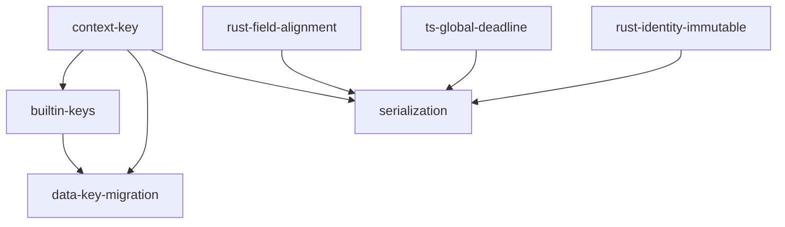

# Context Redesign — Implementation Plan

## Goal

Align the Context struct/class across Python, TypeScript, and Rust SDKs to a single canonical definition, introducing `ContextKey<T>` for type-safe data access, fixing data key naming conventions, adding serialization versioning, and resolving per-SDK field mismatches.

## Architecture Design

### Component Structure

The redesign introduces three new modules per SDK and modifies existing Context and middleware code:

```
Per SDK (Python / TypeScript / Rust):
┌──────────────────────────────────────────────────────┐
│  context_key module (NEW)                            │
│  - ContextKey<T> generic class/struct                │
│  - get(), set(), delete(), exists(), scoped()        │
├──────────────────────────────────────────────────────┤
│  context_keys module (NEW)                           │
│  - TRACING_SPANS, METRICS_STARTS, etc.               │
│  - RETRY_COUNT_BASE (scoped key pattern)             │
├──────────────────────────────────────────────────────┤
│  context module (MODIFY)                             │
│  - serialize() / deserialize() with _context_version │
│  - Field additions/removals per SDK                  │
│  - Identity immutability (Rust)                      │
├──────────────────────────────────────────────────────┤
│  middleware/ (MODIFY)                                │
│  - Migrate legacy key names to _apcore.* convention  │
│  - Use ContextKey constants instead of raw strings   │
└──────────────────────────────────────────────────────┘
```

### Data Flow


### Technical Choices

| Decision | Choice | Rationale |
|----------|--------|-----------|
| ContextKey storage | Wraps existing `context.data` map | No new storage mechanism; type safety is compile/IDE-time only |
| Rust ContextKey bounds | Separate `impl` blocks for `Serialize` / `DeserializeOwned` | A key may be read-only or write-only |
| Rust Identity immutability | Private fields + pub getters + `Identity::new()` constructor | Matches spec requirement; serde compat via `#[serde(from = "IdentityRaw")]` |
| Serialization version | Top-level `_context_version: 1` peer of `trace_id` | Forward compatibility; unknown versions warn but do not fail |
| Data key filtering | `_`-prefixed keys excluded from serialized `data` | Framework-internal keys are not cross-process portable |
| globalDeadline type | `f64` / `number` / `float` (epoch seconds) across all SDKs | Cross-language alignment; `Instant` is not serializable |

## Task Breakdown

### Dependency Graph



### Task List

| Task ID | Title | Description | Deps | Est. Time |
|---------|-------|-------------|------|-----------|
| context-key | ContextKey\<T\> typed accessor | Implement `ContextKey<T>` class/struct in all 3 SDKs with `get()`, `set()`, `delete()`, `exists()`, `scoped()`. TDD: write tests first for AC-001, AC-002, AC-016, AC-017, AC-018. | none | 3h |
| builtin-keys | Built-in context key constants | Define framework-internal key constants (`TRACING_SPANS`, `METRICS_STARTS`, `LOGGING_START`, `REDACTED_OUTPUT`, `RETRY_COUNT_BASE`, etc.) in dedicated modules per SDK. | context-key | 1h |
| rust-field-alignment | Rust Context field removal | Remove `created_at`, `parent_trace_id`, `trace_context` from Rust `Context<T>`. Remove unused imports (`chrono`, `TraceContext`). Change `global_deadline` from `Option<Instant>` to `Option<f64>`. TDD: compile-fail tests for AC-019. | none | 2h |
| rust-identity-immutable | Rust Identity immutability | Make Rust `Identity` fields private, add `Identity::new()` constructor and pub getters. Add serde compatibility via raw struct pattern. TDD: compile-fail test for AC-015. | none | 2h |
| ts-global-deadline | TypeScript globalDeadline field | Add `globalDeadline: number \| null` field to TypeScript `Context` class. Wire into constructor with default `null`. TDD: unit test for AC-020. | none | 1h |
| data-key-migration | Data key naming migration | Rename `_metrics_starts` to `_apcore.mw.metrics.starts`, `_usage_starts` to `_apcore.mw.usage.starts`, `_obs_logging_starts` to `_apcore.mw.logging.starts` across all 3 SDKs. Update middleware to use `ContextKey` constants. TDD: grep verification for AC-021. | context-key, builtin-keys | 2h |
| serialization | Context serialization protocol | Implement `serialize()` / `deserialize()` on Context in all 3 SDKs. Include `_context_version: 1`, exclude `executor`/`services`/`cancel_token`/`global_deadline`, filter `_`-prefixed data keys. TDD: tests for AC-003, AC-004, AC-005. | context-key, rust-field-alignment, rust-identity-immutable, ts-global-deadline | 3h |

## Risks and Considerations

| Risk | Impact | Mitigation |
|------|--------|------------|
| **Rust compile-fail tests are fragile** | CI breakage on compiler version changes | Use `trybuild` crate with pinned error message patterns; review on Rust version bumps |
| **Rust RwLock poisoning in ContextKey** | Silent data loss on panicked threads | Match existing `SharedData` behavior; document that panics in data-accessing code poison the lock |
| **Type erasure at runtime** | `ContextKey[int]` can hold a string if user writes to `data` directly | Document as known limitation; runtime enforcement deferred per OQ-001 |
| **Middleware key migration is breaking** | Any third-party code using old key names will break | Old keys are internal-only (`_`-prefixed), not part of public API. No backward compat needed per spec. |
| **Serde compat for private Identity fields** | `#[derive(Deserialize)]` does not work with private fields | Use `#[serde(from = "IdentityRaw")]` pattern with a public raw intermediate struct |
| **Forward-compat deserialization** | Future `_context_version: 2` may add unknown fields | Spec requires unknown fields be preserved; implement via catch-all map or `#[serde(flatten)]` |

## Acceptance Criteria

- [ ] **AC-001**: `ContextKey.get()` returns typed value from `context.data` (all 3 SDKs)
- [ ] **AC-002**: `ContextKey.scoped(suffix)` creates sub-key with `{name}.{suffix}` (all 3 SDKs)
- [ ] **AC-003**: Context serialization includes `_context_version: 1` at top level (all 3 SDKs)
- [ ] **AC-004**: Serialization excludes `executor`, `services`, `cancel_token`, `global_deadline` (all 3 SDKs)
- [ ] **AC-005**: Serialization filters `_`-prefixed keys from `data` (all 3 SDKs)
- [ ] **AC-015**: Rust `Identity` fields are immutable (compile-fail test)
- [ ] **AC-016**: `ContextKey.get()` with absent key returns default (all 3 SDKs)
- [ ] **AC-017**: `ContextKey.delete()` on absent key is no-op (all 3 SDKs)
- [ ] **AC-018**: `ContextKey.exists()` returns False/false for absent, True/true for present (all 3 SDKs)
- [ ] **AC-019**: Rust Context no longer has `created_at`, `parent_trace_id`, `trace_context` fields (compile-fail test)
- [ ] **AC-020**: TypeScript Context has `globalDeadline` field (unit test)
- [ ] **AC-021**: Data key naming migration complete — no occurrences of `_metrics_starts`, `_usage_starts`, `_obs_logging_starts` in source (grep verification)

## References

- Feature spec: `docs/features/context-redesign.md`
- Design spec (Section 1): `docs/spec/design-context-annotations-acl.md` Section 1 — Context
- Python SDK: `apcore-python/src/apcore/context.py`
- TypeScript SDK: `apcore-typescript/src/context.ts`
- Rust SDK: `apcore-rust/src/context.rs`
- Test locations: `apcore-python/tests/`, `apcore-typescript/tests/`, `apcore-rust/tests/`
